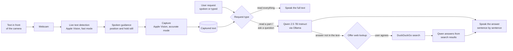
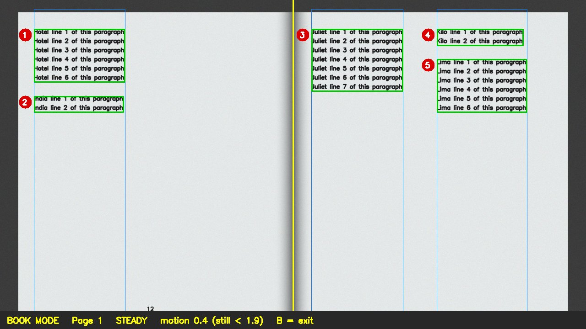
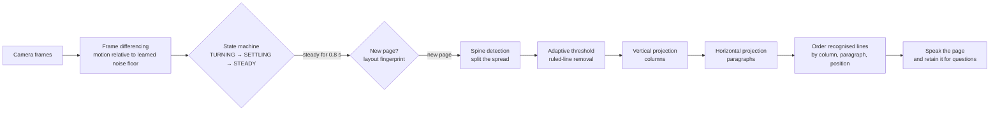
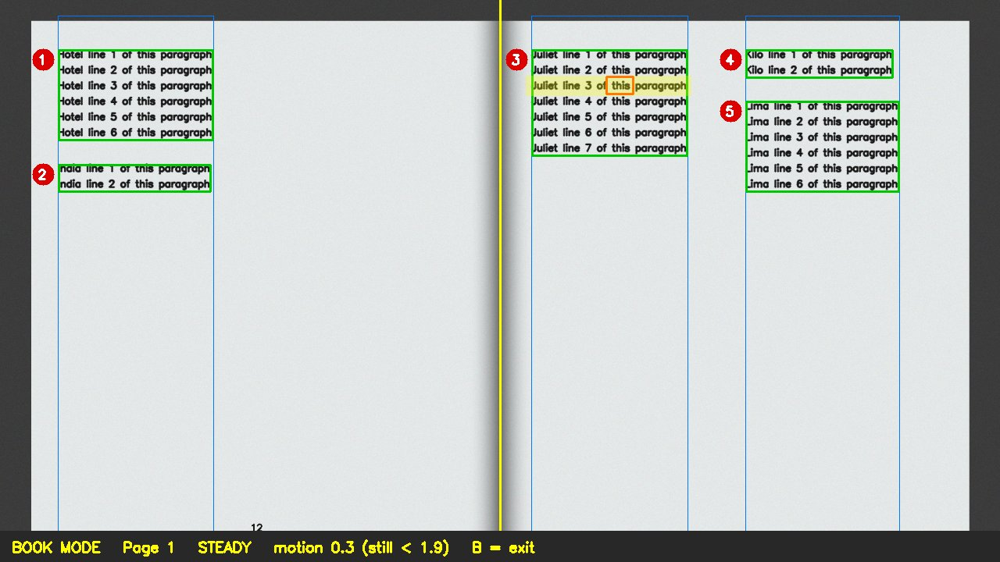

# Helping Eyes — Computer Vision-Based Document Reading System for the Visually Impaired

## Table of Contents

1. [Problem Statement](#problem-statement)
2. [Introduction](#introduction)
3. [Objectives](#objectives)
4. [System Architecture](#system-architecture)
5. [Design Approach](#design-approach)
6. [Project Structure](#project-structure)
7. [Hardware & Software Requirements](#hardware--software-requirements)
8. [Environment Setup](#environment-setup)
9. [Installation](#installation)
10. [Running the System](#running-the-system)
11. [Usage & Controls](#usage--controls)
12. [Computer Vision: Book Reading Mode](#computer-vision-book-reading-mode)
13. [Performance](#performance)
14. [Innovations](#innovations)
15. [Known Limitations](#known-limitations)
16. [References](#references)
17. [Troubleshooting](#troubleshooting)

---

## Problem Statement

Visually impaired individuals face significant barriers when accessing printed materials such as books, documents, medicine labels and signage. Existing assistive solutions have several limitations:

- **Cost:** most commercially available reading aids are expensive.
- **Dedicated hardware:** they require special-purpose devices rather than equipment people already own.
- **Low-light performance:** real-time reading in poor lighting remains difficult for traditional OCR systems.
- **Accuracy:** conventional OCR pipelines struggle with blur, complex backgrounds and varied fonts.
- **Information overload:** reading an entire label aloud forces the user to listen to everything to find the one detail they need.

Helping Eyes addresses these gaps with an affordable reading assistant that runs on an ordinary Mac with a webcam and answers the user's questions about what the camera sees.

---

## Introduction

**Helping Eyes** is an assistive reading application for visually impaired users. It runs on a Mac with a USB or built-in webcam. Rather than reading everything aloud, it lets the user ask about the captured text and returns only the information requested.

Core capabilities:

- **Live text detection** on any object — pages, books, medicine packs, labels, signs and screens — using Apple Vision.
- **Spoken guidance** ("Move closer", "Move left") until the text is in view, followed by automatic capture.
- **Spoken or typed requests** about the captured text:
  - *"Read everything"* reads the full captured text exactly as recognised.
  - *"Read only the dosage"* reads just the requested part.
  - *"When does it expire?"* or *"Is this safe for children?"* is answered from the text.
- **Local language model:** answers come from Qwen 2.5 7B Instruct running in Ollama and are spoken sentence by sentence as they are generated.
- **Optional web lookup:** when the text does not contain the answer, the application offers to search online and does so only with the user's consent.
- **Book reading mode:** a custom OpenCV pipeline detects page turns, separates two-page spreads, orders columns and paragraphs, and highlights the exact word being read on screen.

Text recognition, layout analysis and question answering run on the device. Speech recognition and the optional web lookup use online services.

---

## Objectives

- Detect text automatically from a live camera feed, on any object.
- Extract text accurately and quickly, on-device.
- Let the user request exactly the information they need instead of listening to everything.
- Answer questions only from the captured text, without inventing details.
- Read books page by page without manual interaction.
- Run the complete system on an ordinary laptop, with no additional hardware.

---

## System Architecture



---

## Design Approach

### Software Design

| Stage | Component | Description |
|---|---|---|
| Image acquisition | Webcam (OpenCV) | Captures continuous 720p frames on a background thread |
| Text detection | Apple Vision, fast mode (`text_vision.py`) | Locates every line of text ten times per second |
| User guidance | `smart_reader.py` | Spoken positioning hints, then a short hold-still countdown |
| Capture | Apple Vision, accurate mode | Recognises all text once and stores it; nothing is read aloud yet |
| Voice input | SpeechRecognition (Google) | Converts spoken requests to text; the terminal also accepts typed requests |
| Understanding | Qwen 2.5 7B Instruct via Ollama (`doc_assistant.py`) | Reads requested parts or answers questions using only the captured text |
| Expiry checks | `doc_assistant.py` | Expiry dates are compared with the current date in code, not by the model |
| Web lookup | DuckDuckGo (`ddgs`) and Qwen | Used only with the user's consent; answers are prefixed with "According to the web" |
| Book reading | OpenCV pipeline (`book_mode.py`) | Page-turn detection, spread splitting, layout analysis and reading order |
| Text-to-speech | macOS `say` (`speech.py`) | Queued, interruptible speech with word-level progress tracking |

---

## Project Structure

```
Helping_Eyes-main/
├── smart_reader.py     # Main application: camera, guidance, capture, requests, book mode
├── doc_assistant.py    # Question answering with Qwen 2.5 7B (Ollama), expiry checks, web lookup
├── book_mode.py        # OpenCV pipeline: page-turn detection, spread splitting, layout analysis
├── text_vision.py      # Apple Vision wrapper: live text detection and accurate recognition
├── speech.py           # Queued, interruptible text-to-speech with spoken-word tracking
├── assitant.py         # Alternative reader: Apple Vision detection, Gemini reads the full text
├── requirment.txt      # Python dependencies
├── .env.example        # Configuration template (copy to .env)
├── docs/               # Screenshots used in this README
└── README.md
```

| File | Main components |
|---|---|
| `smart_reader.py` | `handle_request()` routes each request to an application command, a full read-out or the model · `capture_document()` stores the captured text · `voice_listener()` and `typed_listener()` accept requests · `BackgroundFrameReader` keeps the latest camera frame |
| `doc_assistant.py` | `DocAssistant.set_document()` and `ask()` stream answers sentence by sentence · `ask_web()` searches and answers from the results · `wants_read_all()` detects full read-out requests · `expiry_checks()` determines whether expiry dates have passed · `web_lookup_allowed()` excludes item-specific questions such as expiry, batch and price |
| `book_mode.py` | `PageTurnDetector` (frame differencing state machine) · `split_spread()` (spine detection) · `find_blocks()` (columns and paragraphs) · `order_lines()` · `read_page()` |
| `text_vision.py` | `find_text_region()` for live detection · `read_text()` and `recognize_text()` for full recognition, including per-word boxes |
| `speech.py` | `Speaker.say()` and `stop()` · `spoke_since()` prevents the microphone from capturing the application's own voice · `say(text, track_from=...)` and `position` report the word currently being spoken |

---

## Hardware & Software Requirements

### Hardware

| Component | Specification |
|---|---|
| Computer | Mac running macOS 13 or later; Apple Silicon with 16 GB RAM recommended for the 7B model |
| Camera | USB webcam or the built-in camera (selected with `CAMERA_INDEX`) |
| Microphone | Built-in microphone, for spoken requests |
| Audio | Built-in speakers or headphones |

### Software

| Component | Purpose |
|---|---|
| Apple Vision (`pyobjc-framework-Vision`) | On-device text detection and recognition |
| Ollama with `qwen2.5:7b-instruct` | Local language model for question answering |
| `ddgs` (DuckDuckGo) | Web search, only with the user's consent; no account or API key required |
| OpenCV and NumPy | Camera capture, book-mode image analysis and on-screen overlays |
| SpeechRecognition and PyAudio | Spoken requests |
| macOS `say` | Text-to-speech |
| Google Gemini API | Cloud text reading in the separate `assitant.py` |

> **Note:** Apple Vision is part of macOS, so the application runs on Macs only.

---

## Environment Setup

Copy `.env.example` to `.env` in the project root and fill it in:

```env
# 0 = first camera macOS lists (a connected USB camera is usually listed first)
CAMERA_INDEX=0

# Local language model served by Ollama
OLLAMA_HOST=http://localhost:11434
LLM_MODEL=qwen2.5:7b-instruct

# Gemini reader only (assitant.py)
API_KEY=<YOUR_GOOGLE_GENERATIVE_AI_KEY>
```

Optional settings: `TEXT_LANGUAGES` (for example `en-US,hi-IN`; automatic detection when unset), `SPEECH_VOICE` (see `say -v '?'`), `SPEECH_RATE` (words per minute) and `GEMINI_MODEL`.

---

## Installation

```bash
# 1. System dependencies (PortAudio is required to build PyAudio)
brew install python@3.13 portaudio
brew install --cask ollama            # or download from https://ollama.com/download

# 2. Language model (approximately 4.7 GB); keep the Ollama application running
ollama pull qwen2.5:7b-instruct

# 3. Virtual environment (Python 3.11–3.13 recommended)
python3.13 -m venv .venv
source .venv/bin/activate

# 4. Python dependencies (the flags point the PyAudio build at Homebrew's PortAudio)
CFLAGS="-I$(brew --prefix)/include" LDFLAGS="-L$(brew --prefix)/lib" \
  python -m pip install -r requirment.txt
```

**macOS permissions.** On first run, macOS requests the following permissions for the application the script is launched from (Terminal, iTerm or VS Code):

- **Camera** (System Settings → Privacy & Security → Camera): required for the webcam.
- **Microphone** (System Settings → Privacy & Security → Microphone): required for spoken requests.

---

## Running the System

### Option A — Smart Reader (recommended)

```bash
python smart_reader.py
```

1. Hold the item in front of the camera and follow the spoken guidance.
2. After the confirmation *"Got it"*, ask a question aloud or type it in the terminal and press Enter.
3. To capture a new item, move the current one out of view briefly (or say *"next"*), then present the new item.

### Option B — Gemini Reader

Reads all captured text aloud using the Gemini cloud API. Requires an internet connection and an API key.

```bash
python assitant.py
```

---

## Usage & Controls

### Spoken or typed requests

| Request | Result |
|---|---|
| "Read everything", "read it", "what does it say" | Reads the full captured text exactly as recognised |
| "Read only the directions", "read the ingredients" | Reads only the requested parts |
| Questions such as "When does it expire?", "How much does it cost?", "Can children take this?" | Answered from the captured text |
| Follow-up questions such as "And how often?" | The last few exchanges about the same item are retained |
| "Yes" or "no" after *"Should I look it up online?"* | Performs or declines the web lookup |
| "Look it up", "search online" | Searches the web for the previous question |
| "Look up tartrazine allergy", "search the web for ..." | Searches the web for the given phrase |
| "Repeat" | Repeats the last answer |
| "Stop" | Stops speaking |
| "Next", "new page", "scan again" | Prepares to capture a new item |
| "Book mode", "read my book" | Switches to book reading mode |
| "Normal mode", "stop book mode" | Returns to single-item capture |

### Keyboard (the video window must have focus)

| Key | Action |
|---|---|
| `q` | Quit |
| `s` | Stop speaking |
| `r` | Capture a new item |
| `a` | Read the full captured text |
| `b` | Toggle book mode |

The microphone listens only while the application is silent, so that it does not capture its own voice. Use `s` to interrupt a long answer.

**Screen states:** `SHOW TEXT HERE` → `ADJUST POSITION` → `HOLD` → `CAPTURED - ASK ME` → `THINKING...` → `SPEAKING...`

**Gemini reader (`assitant.py`):** does not support questions or voice commands. It sends the captured frame to Gemini and reads all text aloud. The only control is `q` (quit).

---

## Computer Vision: Book Reading Mode

Book mode reads a book page by page without manual interaction: the user opens the book in front of the camera, listens, and turns the page. Apple Vision recognises the characters of each line; **the decisions of when to read, where each page lies and in what order to read are made by the project's own OpenCV pipeline** in [`book_mode.py`](book_mode.py).



*Book mode on a synthetic two-page spread: the detected spine (yellow), text columns (blue) and paragraphs (green), numbered in reading order.*



### 1. Page-turn detection: frame differencing and a state machine

- Each frame is reduced to 320×180, converted to grayscale and blurred. The **mean absolute difference** from the previous frame measures motion, and a **median over the last five frames** suppresses isolated noisy frames.
- The detector **learns the camera's noise floor** (a running average of motion while the scene is still) and sets its movement and stillness thresholds relative to it, making it robust across cameras and lighting conditions.
- A state machine (`TURNING` → `SETTLING` → `STEADY`) triggers a read once the page has been still for 0.8 s.
- **Same-page check:** an 80×45 binary *layout fingerprint* (adaptive threshold with horizontal dilation, so that each text line forms a band) is compared with the last page read. A hand passing over the page does not trigger a re-read; a new page does.

### 2. Two-page spread splitting: spine detection

- **Book localisation:** an Otsu threshold on the blurred image separates the paper from the background; a morphological closing fills in the text, and the union of large paper regions gives the book's outline. Only regions clearly wider than they are tall are treated as spreads; single pages are not split.
- **Shadow cue:** a partially opened book casts a shadow along the spine, visible as a **dark valley** in the column-wise mean brightness. When the valley is at least 12% darker than both pages, the spread is split there.
- **Text-free strip cue:** a fully opened book casts little or no shadow, and the spine region is often the brightest part of the image. Because text never crosses the spine, the two inner margins form the **smoothest vertical strip** of the book. Texture is measured as the **local standard deviation of brightness** per column (text remains textured even when slightly blurred, blank paper does not), and the smooth strip nearest the centre of the book is selected.

### 3. Layout analysis: columns and paragraphs

- An **adaptive Gaussian threshold** converts the page to ink pixels; a small morphological opening removes speckle noise.
- **Ruled-line removal:** morphological openings with long, thin kernels isolate straight lines (page edges, rules, table borders), which are subtracted so that they do not bridge the gaps between columns.
- **Columns:** a **vertical projection profile** (ink per x position) reveals column gaps as wide runs of empty columns. Gaps between words do not align from line to line and therefore do not appear as gaps.
- **Paragraphs:** within each column, a **horizontal projection profile** identifies text lines; a gap substantially taller than the typical line spacing starts a new paragraph.
- **Reading order:** each line recognised by Apple Vision is assigned to the block containing its centre. Blocks are read column by column and paragraph by paragraph, and words hyphenated across lines are rejoined.

### 4. Reading position highlight

While a page is read aloud, the display follows the speech word by word: the **line being spoken is highlighted** and the **word being spoken is outlined**.



- **Spoken position:** macOS `say --interactive` redraws the text with the current word emphasised. The application runs `say` on a pseudo-terminal, parses these redraws and converts them to a character position in the page text (`Speaker.position` in `speech.py`). The page is spoken one paragraph at a time, so the start-up delay of each `say` process coincides with the natural pause between paragraphs.
- **On-page location:** during recognition, Apple Vision provides a bounding box for every word (`boundingBoxForRange`), and `read_page()` records which characters of the page text belong to which printed line and word (`PageLayout.lines`, `line_at()`, `word_at()`).
- Combining the two yields the exact on-screen location of the word being spoken.

### Evaluation

| Test | Result |
|---|---|
| Spine detection, spread with a shadow (synthetic) | Exact (x = 960 of 1920; 640 of 1280) |
| Spine detection, fully opened book captured with the USB camera (no shadow) | x = 645, within the blank strip between the pages (approximately 570–665) |
| Spine detection, flat spreads without a shadow (synthetic) | Within the blank strip between the pages |
| Single portrait page | Correctly not split |
| Column and paragraph detection (synthetic spread) | Left page: 1 column, 3 paragraphs; right page: 2 columns, 2 + 2 paragraphs; all correct |
| Page-turn sequences (still page, hand passing over, page turned, new page), 10 random noise seeds | 10/10 correct: first page read after about 0.9 s of stillness, no re-read when a hand passes over, new page read about 1 s after the turn |
| Reading-order score, full-width two-page spread | 1.00 with book mode; 0.98 with Apple Vision alone |
| Words mapped to their on-screen box (two-page spread) | 169 / 169 |
| Processing time | Page-turn detector 0.2 ms per frame; spine and layout analysis 8 ms; full page including recognition and word boxes about 300 ms |

Apple Vision's native line order is already reliable on clean pages. The principal benefits of book mode are hands-free page turning, correct handling of two-page spreads, paragraph structure and the reading position highlight.

---

## Performance

Measured on an Apple Silicon Mac:

| Operation | Time |
|---|---|
| Live text detection (Apple Vision, fast mode) | 10–40 ms per frame |
| Full capture of a label (Apple Vision, accurate mode) | 0.1–0.2 s |
| First spoken sentence of an answer (Qwen 2.5 7B) | 0.5–1.5 s |
| Full read-out request | Immediate (no model involved) |
| Web lookup (search and answer) | 5–9 s |
| Book mode, page turn to start of reading | 1–2 s (0.8 s settling, about 0.3 s recognition, about 1 s speech start-up) |

---

## Innovations

### 1. Question-driven reading
A medicine package can contain hundreds of words. Instead of reading everything aloud, the user asks for the specific information needed — the dosage, the expiry date or a warning — and receives a short spoken answer.

### 2. Text detection instead of object detection
Helping Eyes detects text directly rather than specific object categories, so any item with readable text — a page, a medicine strip, a food package, a sign or a screen — can be captured.

### 3. Grounded, on-device answers
Text recognition and question answering run locally. The model is instructed to use only the captured text and to state when the answer is not present, and expiry dates are evaluated in code rather than by the model.

### 4. Hands-free book reading
A custom OpenCV pipeline detects page turns, splits two-page spreads, orders columns and paragraphs, and highlights the word being read, allowing a book to be read page by page without any manual interaction.

---

## Known Limitations

- **Platform:** Apple Vision is part of macOS; the application runs on Macs only.
- **Speech recognition requires internet access:** spoken requests are processed by Google's speech service. Typed requests work offline.
- **No voice interruption:** the microphone is inactive while the application speaks. Use `s` to stop a long answer.
- **Background text:** any text in view (keyboard keys, a screen) may be included in the capture. Holding the item close to the camera reduces this.
- **New captures:** a new item is captured only after the previous text leaves the view briefly, or after `r` or "next".
- **Recognition errors:** small, curved, reflective or blurred print may be misread, and answers can only be as accurate as the captured text.
- **Web lookups:** only the search query (the question and the product name) leaves the device; the captured text is not sent. Answers depend on the quality of search results. Lookups are never offered for item-specific details such as expiry, batch or price.
- **Book mode:** evaluated on synthetic spreads and a real camera frame. Strong page curvature, uneven lighting, fingers over the text and illustrations near the centre of a spread can affect spine and column detection. Motion blur prevents recognition, so the book should be held steady or placed on a surface.
- **Model accuracy:** although the model is restricted to the captured text, a 7B model can still misread or confuse details. Medically important information should be confirmed with a pharmacist or doctor.

---

## References

1. U. Gawande, N. Rathod, P. Bodkhe, P. Kolhe, H. Amlani and C. Thaokar, "Novel Machine Learning based Text-To-Speech Device for Visually Impaired People," *2023 2nd International Conference on Smart Technologies and Systems for Next Generation Computing (ICSTSN)*, Villupuram, India, 2023, pp. 1–5. doi: 10.1109/ICSTSN57873.2023.10151637

2. D. S R, V. K. Gowda, R. Rai R, S. Kumar S and V. K P, "Smart Reader for Blind People," *2025 International Conference in Advances in Power, Signal, and Information Technology (APSIT)*, Bhubaneswar, India, 2025, pp. 1–4. doi: 10.1109/APSIT63993.2025.11086193

3. A. Sharma, A. Srivastava, and A. Vashishth, "An Assistive Reading System for Visually Impaired using OCR and TTS," *International Journal of Computer Applications*, vol. 95, no. 2, pp. 13–18, Jun. 2014. doi: 10.5120/16566-6231

4. Apple, "Recognizing Text in Images," Apple Developer Documentation (Vision framework). https://developer.apple.com/documentation/vision/recognizing-text-in-images

---

## Troubleshooting

| Issue | Solution |
|---|---|
| "I can't reach the language model" | Open the Ollama application (or run `ollama serve`) and confirm that `ollama list` includes `qwen2.5:7b-instruct`. |
| "Sorry, I couldn't search online right now" | Check the internet connection. DuckDuckGo may rate-limit requests; wait a minute and try again. |
| The web lookup is never offered | The offer appears only when the answer is not in the text, and never for expiry, batch or price. Say "look it up" to search directly. |
| The first answer is slow | The model loads at start-up; the first answer after a long idle period may take a few seconds. |
| `Cannot open webcam` | Close other applications using the camera (FaceTime, Zoom, Photo Booth) and try the other `CAMERA_INDEX` (`0` or `1`). |
| The wrong camera opens | Swap `CAMERA_INDEX` between `0` and `1`. A nearby iPhone may also appear as a camera (Continuity Camera). |
| The camera fails to open on macOS | Grant **Camera** access to the terminal or VS Code (System Settings → Privacy & Security → Camera), then quit and reopen it. |
| Book mode does not read the page | Hold the book still for about one second; the `motion` value in the status bar must fall below the `still <` threshold. Keep hands off the page. |
| Book mode reads the same page again | The book moved substantially between reads. Keep the book in place and only turn the pages. |
| A new item is not captured | Move the previous item out of view briefly, press `r`, or say "next". |
| A spoken question is not recognised | Wait until the application stops speaking before asking. Grant **Microphone** access to the terminal or VS Code, or type the question in the terminal. |
| Text is read in the wrong language | Set `TEXT_LANGUAGES` in `.env`, for example `en-US,hi-IN`. |
| No speech output | Run `say hello` in the terminal and check the audio output device. |
| `PyAudio` fails to build | Run `brew install portaudio`, then reinstall with the `CFLAGS` and `LDFLAGS` shown under Installation. |
