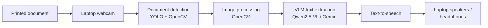

# Helping Eyes — Computer Vision-Based Document Reading System for the Visually Impaired

## Table of Contents

1. [Problem Statement](#problem-statement)
2. [Introduction](#introduction)
3. [Objectives](#objectives)
4. [System Architecture](#system-architecture)
5. [Design Approach](#design-approach)
6. [Hardware & Software Requirements](#hardware--software-requirements)
7. [Environment Setup](#environment-setup)
8. [Installation](#installation)
9. [Running the System](#running-the-system)
10. [Usage & Controls](#usage--controls)
11. [Performance & Evaluation](#performance--evaluation)
12. [Innovations](#innovations)
13. [References](#references)
14. [Troubleshooting](#troubleshooting)

---

## Problem Statement

Visually impaired individuals face significant barriers when accessing printed materials such as books, documents, and signage. Current assistive solutions suffer from several limitations:

- **Cost:** Most commercially available reading aids are expensive and out of reach for many users.
- **Extra hardware:** Existing solutions need dedicated devices instead of equipment people already own.
- **Low-light performance:** Real-time document reading in poor lighting conditions remains a challenge for traditional OCR-based systems.
- **Accuracy:** Conventional OCR pipelines struggle with blurred images, complex backgrounds, and varied fonts.

Helping Eyes addresses these gaps with an affordable, autonomous reading assistant that runs on an ordinary laptop and its webcam.

---

## Introduction

**Helping Eyes** is an AI-powered assistive reading application for visually impaired users. It runs entirely on a laptop, using the built-in webcam, to give a seamless, hands-free reading experience.

Core capabilities:

- Captures printed documents in real time using the **laptop's webcam**.
- Enhances captured frames using **OpenCV** image preprocessing techniques.
- Detects document boundaries automatically before passing the image forward.
- Extracts text intelligently using a **Vision Language Model (VLM)** — replacing conventional OCR for dramatically improved accuracy.
- Converts the extracted text to natural speech via a **Text-to-Speech (TTS)** engine and plays it through the laptop's speakers or headphones.

The entire pipeline runs with minimal user interaction, making the application highly accessible.

---

## Objectives

- Detect printed documents automatically from a live camera feed.
- Enhance captured images using OpenCV (denoising, contrast adjustment, perspective correction).
- Integrate a Vision Language Model (VLM) for context-aware, accurate text extraction.
- Convert extracted text into clear speech output.
- Run the complete system on an ordinary laptop, with no extra hardware.

---

## System Architecture

The end-to-end pipeline follows a linear flow from image capture to audio output:



---

## Design Approach

### Software Design

| Stage | Component | Description |
|---|---|---|
| Image Acquisition | Laptop webcam (OpenCV) | Captures continuous 720p frames from the built-in camera |
| Image Processing | OpenCV | Applies denoising, sharpening, adaptive thresholding, perspective warp |
| Document Detection | Contour / YOLO heuristics | Detects and crops the printed document region |
| Text Extraction | VLM (Qwen2.5-VL via Ollama, or Gemini) | Context-aware, high-accuracy text recognition from the cropped image |
| Text-to-Speech | macOS `say` / Windows SAPI / espeak-ng (`speech.py`) | Converts extracted text to natural speech |
| Audio Output | Laptop speakers / headphones | Delivers speech to the user |

---

## Hardware & Software Requirements

### Hardware

| Component | Specification |
|---|---|
| Laptop | macOS (Apple Silicon recommended), Windows or Linux; 16 GB RAM recommended for the local 7B model |
| Camera | Built-in webcam, or any USB webcam (set `CAMERA_INDEX`) |
| Microphone | Built-in mic, for voice commands |
| Audio | Built-in speakers or headphones |

### Software

| Component | Purpose |
|---|---|
| OpenCV | Image capture, preprocessing, document detection |
| NumPy | Array and matrix operations |
| Qwen2.5-VL 7B (via Ollama) | Local Vision Language Model for text extraction |
| Google Gemini API | Cloud VLM alternative (via `google-generativeai`) |
| `speech.py` | Cross-platform TTS: macOS `say`, Windows SAPI (PowerShell), Linux `espeak-ng` |
| SpeechRecognition + PyAudio | Voice commands ("stop", "repeat", "next") |
| Ultralytics YOLOv8 | Object/document detection (uses `yolov8n.pt`) |

> **Note:** The TTS backend is picked automatically by `speech.py`. macOS uses the built-in `say` command, so no extra install is needed. On Apple Silicon, YOLO runs on the GPU (MPS) automatically.

---


## Environment Setup

Copy `.env.example` to `.env` in the project root and fill it in:

```env
# Laptop webcam: 0 = built-in camera, 1/2... = external USB camera
CAMERA_INDEX=0

# --- For Gemini cloud reader (assitant.py) ---
API_KEY=<YOUR_GOOGLE_GENERATIVE_AI_KEY>

# --- For local Qwen reader (smart_reader_qwen.py) ---
OLLAMA_HOST=http://localhost:11434
VLM_MODEL=qwen2.5vl:7b
```

Other optional settings: `YOLO_DEVICE` (`mps` / `cpu`), `SPEECH_VOICE` (see `say -v '?'`), `SPEECH_RATE` (words per minute), `VLM_BASE_URL` (e.g. `http://localhost:1234/v1` for LM Studio), `GEMINI_MODEL`.

---

## Installation

### macOS (Apple Silicon or Intel)

```bash
# 1. System dependencies (PortAudio is needed to build PyAudio for voice commands)
brew install python@3.13 portaudio
brew install --cask ollama            # or download from https://ollama.com/download

# 2. Virtual environment (Python 3.11–3.13 recommended)
python3.13 -m venv .venv
source .venv/bin/activate

# 3. Python dependencies (the flags point the PyAudio build at Homebrew's PortAudio)
CFLAGS="-I$(brew --prefix)/include" LDFLAGS="-L$(brew --prefix)/lib" \
  python -m pip install -r requirment.txt

# 4. Local Qwen reader only: pull a vision model (open the Ollama app, or run `ollama serve`)
ollama pull qwen2.5vl:7b
```

**macOS permissions.** The first time you run a script, macOS will ask for these. Grant them to the app you run it from (Terminal, iTerm or VS Code):
- **Camera** (System Settings → Privacy & Security → Camera): required for the webcam.
- **Microphone** (System Settings → Privacy & Security → Microphone): required for voice commands in `smart_reader_qwen.py`.

### Windows / Linux

```bash
python -m venv .venv
.venv\Scripts\activate                # Windows
source .venv/bin/activate              # Linux
python -m pip install -r requirment.txt
# Linux only: sudo apt install espeak-ng portaudio19-dev
```

`yolov8n.pt` is downloaded automatically by Ultralytics on first run.

---

## Running the System

### Option A — Gemini Cloud Reader (simple, requires internet + API key)

```bash
python assitant.py
```

### Option B — Local Qwen Reader (text extraction runs locally)

```bash
python smart_reader_qwen.py
```

Text extraction runs locally through Ollama. Voice commands use Google's online speech recognition, so they need internet.

---

## Usage & Controls

| Input | Action |
|---|---|
| `q` | Quit the application |
| `s` | Stop current speech output |
| `r` | Restart camera capture |
| Voice: `"stop"` / `"stop speaking"` | Stop speech (microphone must be active) |
| Voice: `"repeat"` | Repeat the last extracted text |
| Voice: `"next"` | Move to the next detected document region |

A window titled **Smart Reader** (or **Smart Reader - Qwen**) will display the live camera feed with detection overlays.

---

## Performance & Evaluation

### VLM vs. Traditional OCR (EasyOCR)

The system was benchmarked against EasyOCR on blurred real-world real-world camera captures:

| Metric | EasyOCR | VLM (Qwen3-VI-8B) |
|---|---|---|
| Character Error Rate (CER) | 0.957 | **0.017** |
| Word Error Rate (WER) | 1.000 | **0.089** |
| Character Accuracy (%) | 4.28 | **98.26** |
| Word Accuracy (%) | 0.00 | **91.06** |
| Similarity (%) | 8.11 | **99.00** |

The VLM approach achieves near-perfect character accuracy (98.26%) vs. essentially 0% for EasyOCR on the same blurred images, demonstrating the decisive advantage of contextual vision-language understanding over traditional pixel-level OCR.

### Pipeline Latency

| Operation | Average Time |
|---|---|
| Frame Capture | 0.03 s |
| Document Detection | 0.10 s |
| Image Preprocessing | 0.15 s |
| VLM Processing | 10.0 s |
| Speech Generation | 1.0 s |

Total end-to-end latency is approximately **~11.3 seconds** per document read. The dominant cost is VLM inference; this can be reduced with a faster GPU, quantised models, or by switching to the Gemini cloud API.

---

## Innovations

### 1. Vision Language Models Instead of Traditional OCR
Rather than relying solely on rule-based OCR (e.g. Tesseract, EasyOCR), Helping Eyes employs a VLM (Qwen3-VI-8B) that brings contextual understanding to text recognition. This yields dramatically higher accuracy on blurred, low-contrast, and real-world camera images — as confirmed by the evaluation metrics above.

### 2. Autonomous Document Reading Pipeline
The system detects, enhances, extracts, and reads aloud with minimal user interaction. No button presses or menu navigation are required — the application identifies when a document is in view and begins reading automatically, making it genuinely accessible for users with no or limited vision.

---

## References

1. U. Gawande, N. Rathod, P. Bodkhe, P. Kolhe, H. Amlani and C. Thaokar, "Novel Machine Learning based Text-To-Speech Device for Visually Impaired People," *2023 2nd International Conference on Smart Technologies and Systems for Next Generation Computing (ICSTSN)*, Villupuram, India, 2023, pp. 1–5. doi: 10.1109/ICSTSN57873.2023.10151637

2. D. S R, V. K. Gowda, R. Rai R, S. Kumar S and V. K P, "Smart Reader for Blind People," *2025 International Conference in Advances in Power, Signal, and Information Technology (APSIT)*, Bhubaneswar, India, 2025, pp. 1–4. doi: 10.1109/APSIT63993.2025.11086193

3. A. Sharma, A. Srivastava, and A. Vashishth, "An Assistive Reading System for Visually Impaired using OCR and TTS," *International Journal of Computer Applications*, vol. 95, no. 2, pp. 13–18, Jun. 2014. doi: 10.5120/16566-6231

4. JaidedAI, "EasyOCR: Ready-to-use OCR with 80+ supported languages." GitHub. https://github.com/JaidedAI/EasyOCR

---

## Troubleshooting

| Issue | Solution |
|---|---|
| `Cannot open webcam` | Close other apps using the camera (FaceTime, Zoom, Photo Booth). For an external camera, try `CAMERA_INDEX=1`. |
| Ollama / Qwen errors | Ensure the Ollama app (or `ollama serve`) is running and the model is pulled: `ollama pull qwen2.5vl:7b`. Check `VLM_MODEL` matches `ollama list`. |
| Google Gemini API failures | Check `API_KEY` in `.env` and network connectivity. |
| No speech output | macOS: run `say hello` in the terminal and check the output device. Linux: install `espeak-ng`. Windows: SAPI ships with the OS. |
| Camera fails to open on macOS | Allow **Camera** access for your terminal / VS Code (System Settings → Privacy & Security → Camera), then fully quit and reopen it. |
| `PyAudio` fails to build on macOS | `brew install portaudio`, then reinstall with the `CFLAGS`/`LDFLAGS` shown in Installation. |
| Voice commands never trigger | Allow **Microphone** access for your terminal / VS Code. |
| `yolov8n.pt` not found | Ultralytics downloads it on first run (internet needed once). Otherwise download it from [Ultralytics](https://github.com/ultralytics/assets/releases) into the project root. |
| Very slow VLM inference | On Apple Silicon Ollama uses the GPU automatically. Try a smaller model (`ollama pull qwen2.5vl:3b`, then set `VLM_MODEL=qwen2.5vl:3b`) or use the Gemini reader. |
