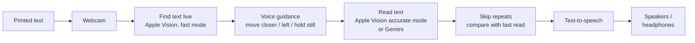

# Helping Eyes — Computer Vision-Based Document Reading System for the Visually Impaired

## Table of Contents

1. [Problem Statement](#problem-statement)
2. [Introduction](#introduction)
3. [Objectives](#objectives)
4. [System Architecture](#system-architecture)
5. [Design Approach](#design-approach)
6. [Hardware & Software Requirements](#hardware--software-requirements)
7. [Environment Setup](#environment-setup)
8. [Installation](#installation)
9. [Running the System](#running-the-system)
10. [Usage & Controls](#usage--controls)
11. [Performance](#performance)
12. [Innovations](#innovations)
13. [References](#references)
14. [Troubleshooting](#troubleshooting)

---

## Problem Statement

Visually impaired individuals face significant barriers when accessing printed materials such as books, documents, and signage. Current assistive solutions suffer from several limitations:

- **Cost:** Most commercially available reading aids are expensive and out of reach for many users.
- **Extra hardware:** Existing solutions need dedicated devices instead of equipment people already own.
- **Low-light performance:** Real-time document reading in poor lighting conditions remains a challenge for traditional OCR-based systems.
- **Accuracy:** Conventional OCR pipelines struggle with blurred images, complex backgrounds, and varied fonts.

Helping Eyes addresses these gaps with an affordable, autonomous reading assistant that runs on an ordinary Mac and a webcam.

---

## Introduction

**Helping Eyes** is an assistive reading application for visually impaired users. It runs on a Mac with a USB or built-in webcam and gives a hands-free reading experience.

Core capabilities:

- Captures text in real time from a **webcam**.
- Finds text live on anything — pages, books, medicine packs, labels, signs, screens — using **Apple Vision**.
- Guides the user by voice ("Move closer", "Move left") until the text is in view.
- Reads the text on-device with Apple Vision, or with **Google Gemini** in the cloud version.
- Speaks the text through the laptop's speakers or headphones.

The entire pipeline runs with minimal user interaction, making the application highly accessible.

---

## Objectives

- Detect text automatically from a live camera feed, on any object.
- Extract text accurately and quickly, on-device.
- Convert extracted text into clear speech output.
- Run the complete system on an ordinary laptop, with no extra hardware.

---

## System Architecture

The end-to-end pipeline follows a linear flow from image capture to audio output:



---

## Design Approach

### Software Design

| Stage | Component | Description |
|---|---|---|
| Image Acquisition | Webcam (OpenCV) | Captures continuous 720p frames |
| Text Detection | Apple Vision, fast mode (`text_vision.py`) | Finds every line of text in each frame (~10 ms) |
| User Guidance | `smart_reader.py` / `assitant.py` | Spoken hints until the text is readable and in view, then a short hold-still countdown |
| Text Extraction | Apple Vision, accurate mode — or Gemini 2.5 Flash | Reads all text, line by line, in reading order |
| Repeat Filtering | Word-overlap similarity | Skips a page it has already read; reads only new words when a page is partly new |
| Text-to-Speech | macOS `say` (`speech.py`) | Converts extracted text to speech, one phrase at a time |
| Audio Output | Laptop speakers / headphones | Delivers speech to the user |

---

## Hardware & Software Requirements

### Hardware

| Component | Specification |
|---|---|
| Computer | Mac running macOS 13 or later (Apple Silicon recommended) |
| Camera | USB webcam or the built-in camera (set `CAMERA_INDEX`) |
| Microphone | Built-in mic, for voice commands |
| Audio | Built-in speakers or headphones |

### Software

| Component | Purpose |
|---|---|
| Apple Vision (`pyobjc-framework-Vision`) | On-device text detection and recognition |
| OpenCV | Camera capture and on-screen overlays |
| NumPy | Array operations |
| Google Gemini API | Cloud text reading in `assitant.py` (via `google-generativeai`) |
| `speech.py` | Text-to-speech using the macOS `say` command |
| SpeechRecognition + PyAudio | Voice commands ("stop", "repeat", "next") |

> **Note:** Apple Vision is part of macOS, so the app runs on Macs only. `speech.py` itself also supports Windows and Linux.

---

## Environment Setup

Copy `.env.example` to `.env` in the project root and fill it in:

```env
# 0 = first camera macOS lists (a plugged-in USB camera usually comes first)
CAMERA_INDEX=0

# Gemini reader only (assitant.py)
API_KEY=<YOUR_GOOGLE_GENERATIVE_AI_KEY>
```

Other optional settings: `TEXT_LANGUAGES` (e.g. `en-US,hi-IN`; unset = auto-detect), `SPEECH_VOICE` (see `say -v '?'`), `SPEECH_RATE` (words per minute), `GEMINI_MODEL`.

---

## Installation

```bash
# 1. System dependencies (PortAudio is needed to build PyAudio for voice commands)
brew install python@3.13 portaudio

# 2. Virtual environment (Python 3.11–3.13 recommended)
python3.13 -m venv .venv
source .venv/bin/activate

# 3. Python dependencies (the flags point the PyAudio build at Homebrew's PortAudio)
CFLAGS="-I$(brew --prefix)/include" LDFLAGS="-L$(brew --prefix)/lib" \
  python -m pip install -r requirment.txt
```

**macOS permissions.** The first time you run a script, macOS will ask for these. Grant them to the app you run it from (Terminal, iTerm or VS Code):
- **Camera** (System Settings → Privacy & Security → Camera): required for the webcam.
- **Microphone** (System Settings → Privacy & Security → Microphone): required for voice commands in `smart_reader.py`.

---

## Running the System

### Option A — Smart Reader (on-device, recommended)

```bash
python smart_reader.py
```

Text is found and read on the Mac by Apple Vision. Voice commands use Google's online speech recognition, so they need internet.

### Option B — Gemini Reader (cloud, requires internet + API key)

```bash
python assitant.py
```

Apple Vision finds the text; Gemini reads it.

---

## Usage & Controls

| Input | Action |
|---|---|
| `q` | Quit the application |
| `s` | Stop current speech output |
| `r` | Restart capture: read the next text in full, even if it looks like the last one |
| Voice: `"stop"` | Stop speech |
| Voice: `"repeat"` | Repeat the last extracted text |
| Voice: `"next"` | Read the next text in full |

`assitant.py` supports only `q`. Click the video window before pressing keys. The microphone listens only while the app is not speaking, so use `s` to interrupt.

A window titled **Smart Reader** displays the live camera feed with a box around each line of text found.

---

## Performance

Measured on an Apple Silicon Mac with a 1280×720 test image:

| Operation | Time |
|---|---|
| Find text (Apple Vision, fast mode) | ~10 ms per frame |
| Read text (Apple Vision, accurate mode) | ~0.1–0.2 s |
| Read text (Gemini, cloud) | depends on network |

---

## Innovations

### 1. Text Detection Instead of Object Detection
Rather than looking for specific objects such as books, Helping Eyes looks for text itself. Anything with readable text — a page, a medicine strip, a food packet, a sign or a screen — triggers guidance and reading.

### 2. Fast, Private, On-Device Reading
Apple Vision reads text on the Mac in a fraction of a second, with no model downloads and no data leaving the device.

### 3. Autonomous Reading Pipeline
The system detects, guides, extracts, and reads aloud with minimal user interaction. No button presses or menu navigation are required — the application notices when text is in view and begins reading automatically, making it genuinely accessible for users with no or limited vision.

---

## References

1. U. Gawande, N. Rathod, P. Bodkhe, P. Kolhe, H. Amlani and C. Thaokar, "Novel Machine Learning based Text-To-Speech Device for Visually Impaired People," *2023 2nd International Conference on Smart Technologies and Systems for Next Generation Computing (ICSTSN)*, Villupuram, India, 2023, pp. 1–5. doi: 10.1109/ICSTSN57873.2023.10151637

2. D. S R, V. K. Gowda, R. Rai R, S. Kumar S and V. K P, "Smart Reader for Blind People," *2025 International Conference in Advances in Power, Signal, and Information Technology (APSIT)*, Bhubaneswar, India, 2025, pp. 1–4. doi: 10.1109/APSIT63993.2025.11086193

3. A. Sharma, A. Srivastava, and A. Vashishth, "An Assistive Reading System for Visually Impaired using OCR and TTS," *International Journal of Computer Applications*, vol. 95, no. 2, pp. 13–18, Jun. 2014. doi: 10.5120/16566-6231

4. Apple, "Recognizing Text in Images," Apple Developer Documentation (Vision framework). https://developer.apple.com/documentation/vision/recognizing-text-in-images

---

## Troubleshooting

| Issue | Solution |
|---|---|
| `Cannot open webcam` | Close other apps using the camera (FaceTime, Zoom, Photo Booth). Try the other `CAMERA_INDEX` (`0` or `1`). |
| Wrong camera opens | Swap `CAMERA_INDEX` between `0` and `1`. An iPhone nearby can also appear as a camera (Continuity Camera). |
| Camera fails to open on macOS | Allow **Camera** access for your terminal / VS Code (System Settings → Privacy & Security → Camera), then fully quit and reopen it. |
| Text is found but never read | Hold the text steady and closer; the app waits for readable text size and a short hold-still. |
| Wrong language read | Set `TEXT_LANGUAGES` in `.env`, e.g. `en-US,hi-IN`. |
| Google Gemini API failures | Check `API_KEY` in `.env` and network connectivity. |
| No speech output | Run `say hello` in the terminal and check the output device. |
| `PyAudio` fails to build | `brew install portaudio`, then reinstall with the `CFLAGS`/`LDFLAGS` shown in Installation. |
| Voice commands never trigger | Allow **Microphone** access for your terminal / VS Code. |
