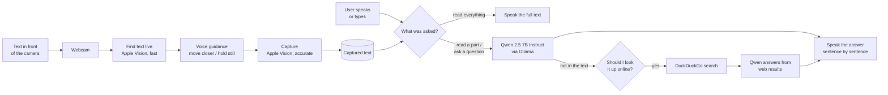

# Helping Eyes — Computer Vision-Based Document Reading System for the Visually Impaired

## Table of Contents

1. [Problem Statement](#problem-statement)
2. [Introduction](#introduction)
3. [Objectives](#objectives)
4. [System Architecture](#system-architecture)
5. [Design Approach](#design-approach)
6. [Project Structure](#project-structure)
7. [Hardware & Software Requirements](#hardware--software-requirements)
8. [Environment Setup](#environment-setup)
9. [Installation](#installation)
10. [Running the System](#running-the-system)
11. [Usage & Controls](#usage--controls)
12. [Performance](#performance)
13. [Innovations](#innovations)
14. [Known Limitations](#known-limitations)
15. [References](#references)
16. [Troubleshooting](#troubleshooting)

---

## Problem Statement

Visually impaired individuals face significant barriers when accessing printed materials such as books, documents, and signage. Current assistive solutions suffer from several limitations:

- **Cost:** Most commercially available reading aids are expensive and out of reach for many users.
- **Extra hardware:** Existing solutions need dedicated devices instead of equipment people already own.
- **Low-light performance:** Real-time document reading in poor lighting conditions remains a challenge for traditional OCR-based systems.
- **Accuracy:** Conventional OCR pipelines struggle with blurred images, complex backgrounds, and varied fonts.

Helping Eyes addresses these gaps with an affordable reading assistant that runs on an ordinary Mac and a webcam, and answers the user's questions about what it sees.

---

## Introduction

**Helping Eyes** is an assistive reading application for visually impaired users. It runs on a Mac with a USB or built-in webcam. Instead of simply reading everything aloud, it lets the user **talk about what the camera saw**.

Core capabilities:

- Finds text live on anything — pages, books, medicine packs, labels, signs, screens — using **Apple Vision**.
- Guides the user by voice ("Move closer", "Move left") until the text is in view, then captures it.
- Lets the user ask by voice (or by typing):
  - **"Read everything"** — reads the full captured text, exactly as Apple Vision read it.
  - **"Read only the dosage"** — reads just the requested parts.
  - **"When does it expire?"**, **"Is this safe for children?"** — answers questions about the text.
- Answers come from a local **Qwen 2.5 7B Instruct** model (via Ollama) and are spoken aloud, sentence by sentence.
- When the text doesn't have the answer, it offers to **look it up online** — and only searches if the user says yes.

Everything except voice recognition runs on the Mac itself.

---

## Objectives

- Detect text automatically from a live camera feed, on any object.
- Extract text accurately and quickly, on-device.
- Let the user ask for exactly what they need instead of listening to everything.
- Answer questions only from the captured text, without inventing details.
- Run the complete system on an ordinary laptop, with no extra hardware.

---

## System Architecture



---

## Design Approach

### Software Design

| Stage | Component | Description |
|---|---|---|
| Image Acquisition | Webcam (OpenCV) | Captures continuous 720p frames |
| Text Detection | Apple Vision, fast mode (`text_vision.py`) | Finds every line of text, 10 times a second |
| User Guidance | `smart_reader.py` | Spoken hints until the text is readable and in view, then a short hold-still countdown |
| Capture | Apple Vision, accurate mode | Reads all text once and keeps it; nothing is read aloud yet |
| Voice Input | SpeechRecognition (Google) | Turns the user's spoken request into text; the terminal also accepts typed requests |
| Understanding | Qwen 2.5 7B Instruct via Ollama (`doc_assistant.py`) | Reads requested parts or answers questions, using only the captured text |
| Expiry Checks | `doc_assistant.py` | Expiry dates are compared with today's date in code, not by the model |
| Web Lookup | DuckDuckGo (`ddgs`) + Qwen | Only after the user agrees; answers start with "According to the web" |
| Text-to-Speech | macOS `say` (`speech.py`) | Speaks each sentence as soon as the model produces it |

---

## Project Structure

```
Helping_Eyes-main/
├── smart_reader.py     # Main app: camera, guidance, capture, voice/typed requests
├── doc_assistant.py    # Qwen 2.5 7B (Ollama): answers questions, reads parts, expiry checks, web lookup
├── text_vision.py      # Apple Vision: find text live (fast) and read it (accurate)
├── speech.py           # Queued, interruptible text-to-speech (macOS `say`)
├── assitant.py         # Alternative reader: Apple Vision finds text, Gemini reads it all aloud
├── requirment.txt      # Python dependencies
├── .env.example        # Settings template (copy to .env)
└── README.md
```

| File | Key pieces |
|---|---|
| `smart_reader.py` | `handle_request()` routes each request (app command, read everything, or the model) · `capture_document()` stores the captured text · `voice_listener()` / `typed_listener()` take requests · `BackgroundFrameReader` keeps the newest camera frame |
| `doc_assistant.py` | `DocAssistant.set_document()` / `ask()` (streams the answer sentence by sentence) · `ask_web()` searches and answers from the results · `wants_read_all()` spots "read it all" requests · `expiry_checks()` works out whether expiry dates have passed · `web_lookup_allowed()` blocks lookups for expiry, batch and price |
| `text_vision.py` | `find_text_region()` for live detection · `read_text()` for the full capture |
| `speech.py` | `Speaker.say()` / `stop()` · `spoke_since()` stops the microphone from hearing the app's own voice |

---

## Hardware & Software Requirements

### Hardware

| Component | Specification |
|---|---|
| Computer | Mac running macOS 13 or later; Apple Silicon with 16 GB RAM recommended for the 7B model |
| Camera | USB webcam or the built-in camera (set `CAMERA_INDEX`) |
| Microphone | Built-in mic, for spoken requests |
| Audio | Built-in speakers or headphones |

### Software

| Component | Purpose |
|---|---|
| Apple Vision (`pyobjc-framework-Vision`) | On-device text detection and recognition |
| Ollama + `qwen2.5:7b-instruct` | Local language model that answers questions about the text |
| `ddgs` (DuckDuckGo) | Web search, only when the user agrees; no account or API key |
| OpenCV | Camera capture and on-screen overlays |
| SpeechRecognition + PyAudio | Spoken requests |
| `speech.py` | Text-to-speech using the macOS `say` command |
| Google Gemini API | Cloud text reading in the separate `assitant.py` |

> **Note:** Apple Vision is part of macOS, so the app runs on Macs only.

---

## Environment Setup

Copy `.env.example` to `.env` in the project root and fill it in:

```env
# 0 = first camera macOS lists (a plugged-in USB camera usually comes first)
CAMERA_INDEX=0

# Local language model served by Ollama
OLLAMA_HOST=http://localhost:11434
LLM_MODEL=qwen2.5:7b-instruct

# Gemini reader only (assitant.py)
API_KEY=<YOUR_GOOGLE_GENERATIVE_AI_KEY>
```

Other optional settings: `TEXT_LANGUAGES` (e.g. `en-US,hi-IN`; unset = auto-detect), `SPEECH_VOICE` (see `say -v '?'`), `SPEECH_RATE` (words per minute), `GEMINI_MODEL`.

---

## Installation

```bash
# 1. System dependencies (PortAudio is needed to build PyAudio for the microphone)
brew install python@3.13 portaudio
brew install --cask ollama            # or download from https://ollama.com/download

# 2. The language model (about 4.7 GB); keep the Ollama app open
ollama pull qwen2.5:7b-instruct

# 3. Virtual environment (Python 3.11–3.13 recommended)
python3.13 -m venv .venv
source .venv/bin/activate

# 4. Python dependencies (the flags point the PyAudio build at Homebrew's PortAudio)
CFLAGS="-I$(brew --prefix)/include" LDFLAGS="-L$(brew --prefix)/lib" \
  python -m pip install -r requirment.txt
```

**macOS permissions.** The first time you run a script, macOS will ask for these. Grant them to the app you run it from (Terminal, iTerm or VS Code):
- **Camera** (System Settings → Privacy & Security → Camera): required for the webcam.
- **Microphone** (System Settings → Privacy & Security → Microphone): required for spoken requests.

---

## Running the System

### Option A — Smart Reader (ask about what the camera sees, recommended)

```bash
python smart_reader.py
```

1. Hold the item up to the camera and follow the spoken hints.
2. When you hear *"Got it"*, ask your question out loud — or type it in the terminal and press Enter.
3. To switch to a new item, move the current one out of view for a moment (or say *"next"*), then show the new one.

### Option B — Gemini Reader (reads everything aloud; cloud, needs an API key)

```bash
python assitant.py
```

---

## Usage & Controls

**Things you can say (or type)**

| Say | What happens |
|---|---|
| "Read everything", "read it", "what does it say" | Reads the full captured text, exactly as captured |
| "Read only the directions", "read the ingredients" | Reads just those parts |
| Any question: "When does it expire?", "How much does it cost?", "Can children take this?" | Qwen answers from the captured text |
| Follow-ups: "And how often?" | Qwen remembers the last few questions about the same item |
| "Yes" / "no" after *"Should I look it up online?"* | Searches the web, or doesn't |
| "Look it up", "search online" | Searches the web for your last question |
| "Look up tartrazine allergy", "search the web for …" | Searches the web for exactly that |
| "Repeat" | Repeats the last answer |
| "Stop" | Stops speaking |
| "Next", "new page", "scan again" | Get ready to capture a new item |

**Keys** (click the video window first)

| Key | Action |
|---|---|
| `q` | Quit |
| `s` | Stop speaking |
| `r` | Capture a new item |
| `a` | Read the full captured text |

The microphone only listens while the app is quiet (so it doesn't hear itself); press `s` to interrupt a long answer.

**Screen states:** `SHOW TEXT HERE` → `ADJUST POSITION` → `HOLD` → `CAPTURED - ASK ME` → `THINKING...` → `SPEAKING...`

**Gemini reader (`assitant.py`):** no questions or voice commands. It sends the captured frame to Gemini and reads all the text aloud. The only key is `q` (quit).

---

## Performance

Measured on an Apple Silicon Mac:

| Operation | Time |
|---|---|
| Find text (Apple Vision, fast mode) | ~10–40 ms per frame |
| Capture a full label (Apple Vision, accurate mode) | ~0.1–0.2 s |
| First spoken sentence of an answer (Qwen 2.5 7B) | ~0.5–1.5 s |
| "Read everything" | instant (no model involved) |
| Web lookup (search + answer) | ~5–9 s |

---

## Innovations

### 1. Ask Instead of Listening to Everything
A medicine box can hold hundreds of words. Instead of reading all of it aloud, the user asks for exactly what they need — the dosage, the expiry date, a warning — and gets a short spoken answer.

### 2. Text Detection Instead of Object Detection
Helping Eyes looks for text itself, not for specific objects, so anything with readable text — a page, a medicine strip, a food packet, a sign or a screen — can be captured.

### 3. Grounded, Private Answers
Apple Vision reads the text and a local Qwen model answers questions on the Mac itself. The model is instructed to use only the captured text and to say when the answer isn't there; expiry dates are checked in code rather than by the model.

---

## Known Limitations

- **Mac only:** Apple Vision is part of macOS.
- **Voice recognition needs internet:** spoken requests go to Google's speech service. Typed requests work offline.
- **No voice interruption:** the microphone is off while the app is speaking, so it doesn't hear itself. Press `s` to stop a long answer.
- **Everything in view is captured:** background text (keyboard keys, a screen) can end up in the capture. Hold the item close so it fills the view.
- **Moving to a new item:** a new capture happens only after the text leaves the view for a moment, or after `r` / "next".
- **OCR mistakes:** small, curved, shiny or blurry print can be misread, and the model's answer can only be as good as the captured text.
- **Web lookups:** only the search query (your question plus the product name) leaves the Mac; the captured text is not sent. Web answers are only as good as the search results, and lookups are never offered for expiry, batch or price, which only the item itself can tell you.
- **Model answers can be wrong:** Qwen is told to use only the captured text, but a 7B model can still misread or mix up details. Check anything medically important with a pharmacist or doctor.

---

## References

1. U. Gawande, N. Rathod, P. Bodkhe, P. Kolhe, H. Amlani and C. Thaokar, "Novel Machine Learning based Text-To-Speech Device for Visually Impaired People," *2023 2nd International Conference on Smart Technologies and Systems for Next Generation Computing (ICSTSN)*, Villupuram, India, 2023, pp. 1–5. doi: 10.1109/ICSTSN57873.2023.10151637

2. D. S R, V. K. Gowda, R. Rai R, S. Kumar S and V. K P, "Smart Reader for Blind People," *2025 International Conference in Advances in Power, Signal, and Information Technology (APSIT)*, Bhubaneswar, India, 2025, pp. 1–4. doi: 10.1109/APSIT63993.2025.11086193

3. A. Sharma, A. Srivastava, and A. Vashishth, "An Assistive Reading System for Visually Impaired using OCR and TTS," *International Journal of Computer Applications*, vol. 95, no. 2, pp. 13–18, Jun. 2014. doi: 10.5120/16566-6231

4. Apple, "Recognizing Text in Images," Apple Developer Documentation (Vision framework). https://developer.apple.com/documentation/vision/recognizing-text-in-images

---

## Troubleshooting

| Issue | Solution |
|---|---|
| "I can't reach the language model" | Open the Ollama app (or run `ollama serve`) and check `ollama list` shows `qwen2.5:7b-instruct`. |
| "Sorry, I couldn't search online right now" | Check the internet connection. DuckDuckGo sometimes rate-limits; wait a minute and try again. |
| It never offers to look things up | The offer only comes when the answer isn't in the text, and never for expiry, batch or price. You can always say "look it up". |
| First answer is slow | The model loads at start-up; the first answer after a long idle may take a few seconds. |
| `Cannot open webcam` | Close other apps using the camera (FaceTime, Zoom, Photo Booth). Try the other `CAMERA_INDEX` (`0` or `1`). |
| Wrong camera opens | Swap `CAMERA_INDEX` between `0` and `1`. An iPhone nearby can also appear as a camera (Continuity Camera). |
| Camera fails to open on macOS | Allow **Camera** access for your terminal / VS Code (System Settings → Privacy & Security → Camera), then fully quit and reopen it. |
| It won't capture a new item | Move the old item out of view for a moment, press `r`, or say "next". |
| My question isn't heard | Wait until the app stops talking, then speak. Allow **Microphone** access for your terminal / VS Code. Or type the question in the terminal. |
| Wrong language read | Set `TEXT_LANGUAGES` in `.env`, e.g. `en-US,hi-IN`. |
| No speech output | Run `say hello` in the terminal and check the output device. |
| `PyAudio` fails to build | `brew install portaudio`, then reinstall with the `CFLAGS`/`LDFLAGS` shown in Installation. |
