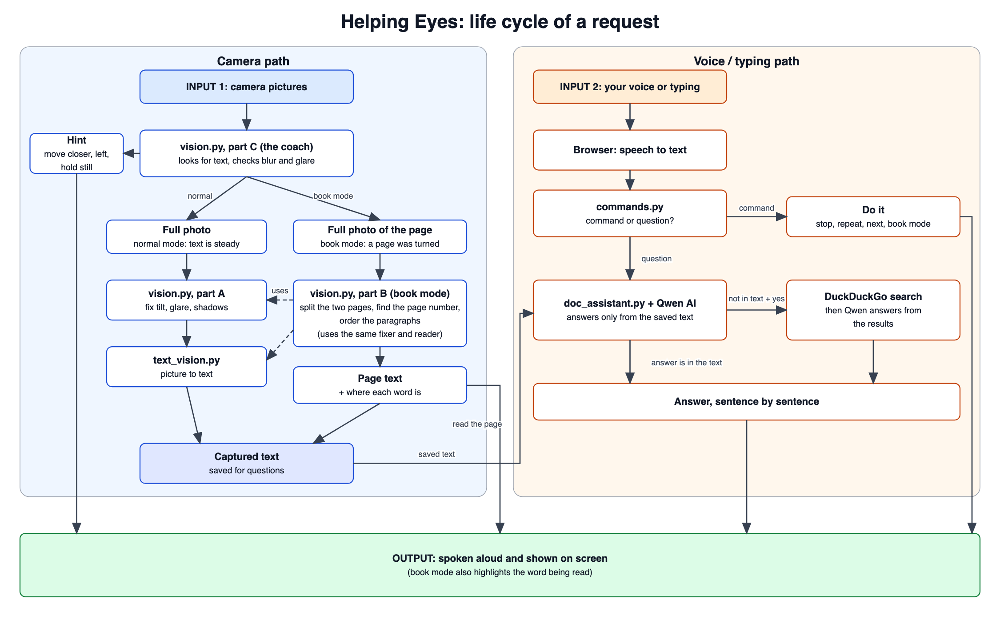
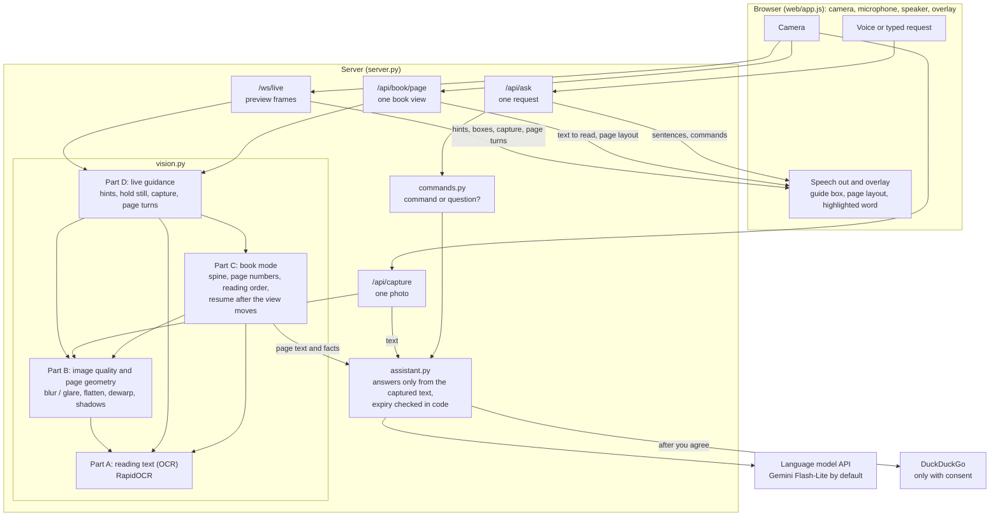
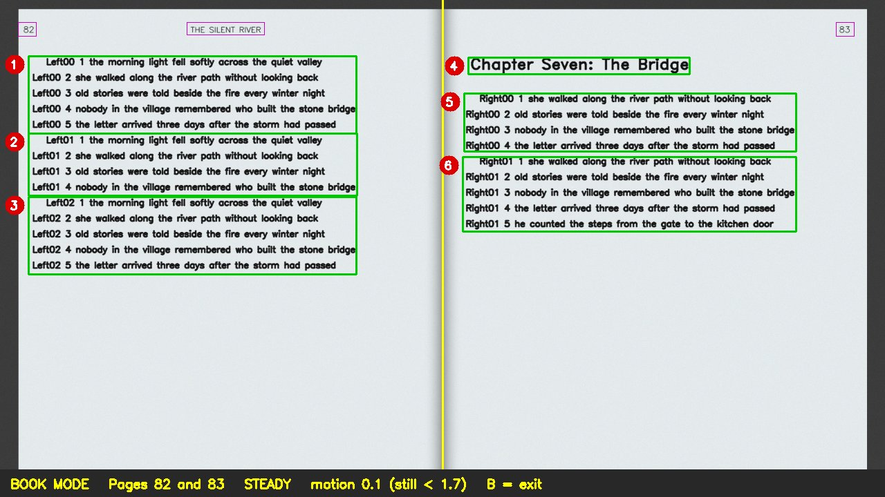
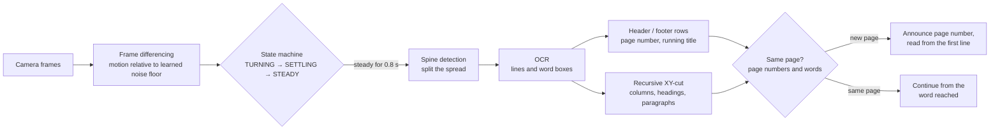
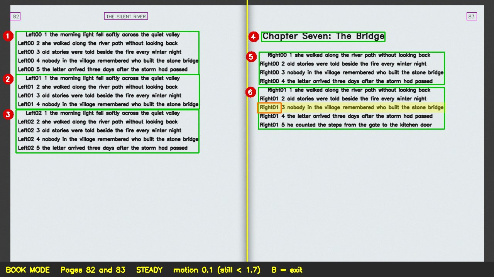

# Helping Eyes — Computer Vision-Based Document Reading System for the Visually Impaired

## Table of Contents

1. [Problem Statement](#problem-statement)
2. [Introduction](#introduction)
3. [Objectives](#objectives)
4. [System Architecture](#system-architecture)
5. [Design Approach](#design-approach)
6. [Project Structure](#project-structure)
7. [Hardware & Software Requirements](#hardware--software-requirements)
8. [Environment Setup](#environment-setup)
9. [Installation](#installation)
10. [Running the System](#running-the-system)
11. [Usage & Controls](#usage--controls)
12. [Computer Vision: Book Reading Mode](#computer-vision-book-reading-mode)
13. [Performance](#performance)
14. [Innovations](#innovations)
15. [Known Limitations](#known-limitations)
16. [References](#references)
17. [Troubleshooting](#troubleshooting)

---

## Problem Statement

Visually impaired individuals face significant barriers when accessing printed materials such as books, documents, medicine labels and signage. Existing assistive solutions have several limitations:

- **Cost:** most commercially available reading aids are expensive.
- **Dedicated hardware:** they require special-purpose devices rather than equipment people already own.
- **Low-light performance:** real-time reading in poor lighting remains difficult for traditional OCR systems.
- **Accuracy:** conventional OCR pipelines struggle with blur, complex backgrounds and varied fonts.
- **Information overload:** reading an entire label aloud forces the user to listen to everything to find the one detail they need.

Helping Eyes addresses these gaps with an affordable reading assistant that runs in an ordinary web browser, on any computer or phone with a camera, and answers the user's questions about what the camera sees.

---

## Introduction

**Helping Eyes** is an assistive reading application for visually impaired users. It is one web application: a browser page owns the camera, microphone and speaker, and a Python server does the reading. The same code runs on a laptop (`uvicorn server:app`) or in the cloud (a Hugging Face Space); the only thing to configure is the language model's API key (and, optionally, its address and model name). Rather than reading everything aloud, it lets the user ask about the captured text and returns only the information requested.

Core capabilities:

- **Live text detection** on any object (pages, books, medicine packs, labels, signs and screens) from the camera preview.
- **Spoken guidance** ("Move closer", "Move left", "Glare on the right, tilt the page") until the text is in view, followed by automatic capture.
- **Spoken or typed requests** about the captured text:
  - *"Read everything"* reads the full captured text exactly as recognised.
  - *"Read only the dosage"* reads just the requested part.
  - *"When does it expire?"* or *"Is this safe for children?"* is answered from the text.
- **Hands-free listening:** the microphone listens only while the application is quiet, so it never answers itself.
- **Language model:** answers come from a hosted chat model (Gemini Flash-Lite by default; any OpenAI-compatible API works) and are spoken sentence by sentence as they are generated.
- **Optional web lookup:** when the text does not contain the answer, the application offers to search online and does so only with the user's consent.
- **Book reading mode:** a custom computer vision pipeline detects page turns, separates two-page spreads, recognises printed page numbers and running titles on any page, orders columns and paragraphs, and highlights the exact word being read on screen.

Text recognition (RapidOCR) and layout analysis run on the server, which can be your own laptop. Only the captured text (never the picture) is sent to the language model, and only the search words are sent for a web lookup. Speech recognition uses the browser's speech service.

---

## Objectives

- Detect text automatically from a live camera feed, on any object.
- Extract text accurately and quickly with open-source OCR.
- Let the user request exactly the information they need instead of listening to everything.
- Answer questions only from the captured text, without inventing details.
- Read books page by page without manual interaction.
- Run on ordinary hardware: any computer with a browser, a free language-model API key and no special equipment.

---

## System Architecture



The picture shows the life cycle of one request, from input to output. The diagram below shows the parts it passes through and how they connect.


```mermaid
flowchart TB
    subgraph BR["Browser (web/app.js): camera, microphone, speaker, overlay"]
        CAM[Camera]
        MIC[Voice or typed request]
        OUT[Speech out and overlay<br/>guide box, page layout, highlighted word]
    end

    subgraph SV["Server (server.py)"]
        WS["/ws/live<br/>preview frames"]
        CAP["/api/capture<br/>one photo"]
        BK["/api/book/page<br/>one book view"]
        ASK["/api/ask<br/>one request"]
        CMD["commands.py<br/>command or question?"]

        subgraph VIS["vision.py"]
            LIVE["Part D: live guidance<br/>hints, hold still, capture, page turns"]
            BOOKM["Part C: book mode<br/>spine, page numbers, reading order,<br/>resume after the view moves"]
            QUAL["Part B: image quality and page geometry<br/>blur / glare, flatten, dewarp, shadows"]
            OCRP["Part A: reading text (OCR)<br/>RapidOCR"]
        end

        DA["assistant.py<br/>answers only from the captured text,<br/>expiry checked in code"]
    end

    LLM[Language model API<br/>Gemini Flash-Lite by default]
    WEB[DuckDuckGo<br/>only with consent]

    CAM --> WS
    CAM --> CAP
    CAM --> BK
    MIC --> ASK

    WS --> LIVE
    BK --> LIVE
    LIVE --> BOOKM
    LIVE --> QUAL
    CAP --> QUAL
    BOOKM --> QUAL
    QUAL --> OCRP
    LIVE --> OCRP
    BOOKM --> OCRP
    BOOKM -- page text and facts --> DA
    CAP -- text --> DA
    ASK --> CMD
    CMD --> DA
    DA --> LLM
    DA -- after you agree --> WEB

    WS -- hints, boxes, capture, page turns --> OUT
    BK -- text to read, page layout --> OUT
    ASK -- sentences, commands --> OUT
```

---

## Design Approach

### Software Design

| Stage | Component | Description |
|---|---|---|
| Image acquisition | Browser camera (`getUserMedia`) | Rear camera at up to 1080p; small preview frames go to the server over a WebSocket, the full-size photo only when capturing |
| Text detection | RapidOCR, quick check (`vision.py`, part A) | Locates every line of text in each preview frame |
| User guidance | `vision.py`, part D (`LiveGuide`) | Spoken positioning hints, blur / glare coaching, then a short hold-still countdown and automatic capture |
| Capture | OCR engine, accurate mode | Recognises all text once and stores it; nothing is read aloud yet |
| Voice input | Browser `SpeechRecognition` | Converts spoken requests to text, hands-free; the page also accepts typed requests |
| Request routing | `commands.py` | Decides whether a request is a command (stop, next, book mode, yes / no, search) or a question; the browser has no command logic of its own |
| Understanding | Language model API (Gemini Flash-Lite by default; `assistant.py`) | Reads requested parts or answers questions using only the captured text |
| Expiry checks | `assistant.py` | Expiry dates are compared with the current date in code, not by the model |
| Web lookup | DuckDuckGo (`ddgs`) and the language model | Used only with the user's consent; answers are prefixed with "According to the web" |
| Image quality | OpenCV layer (`vision.py`, part B) | Blur, glare and exposure scoring with spoken coaching; page detection and homography flattening; curved-line dewarping; shadow removal and CLAHE when quality is low |
| Book reading | OpenCV pipeline (`vision.py`, parts C and D) | Page-turn detection, spread splitting, layout analysis, reading order, resuming after the view moves |
| Text-to-speech | Browser `speechSynthesis` | Queued, interruptible speech; the word being spoken is reported back for the on-screen highlight |

---

## Project Structure

```
Helping_Eyes-main/
├── helping_eyes/           # The application: one codebase for a laptop and for the cloud
│   ├── server.py           # FastAPI server: live stream, capture, book pages, requests, health
│   ├── vision.py           # All the computer vision in four parts: A reading text (OCR), B image quality, C book mode, D live guidance
│   ├── commands.py         # What a spoken or typed request means
│   ├── assistant.py    # Question answering through a language model API, expiry checks, web lookup
│   ├── web/                # The page: index.html, app.js (camera, speech, overlay), style.css
│   ├── cloud/              # Dockerfile, start script, Space README, deploy script
│   ├── tests/              # one test file per part of vision.py (ocr, quality, book, live), plus commands, llm and server
│   └── .env.example        # Optional settings (copy to .env)
├── docs/                   # Diagrams and screenshots used in the docs (make_architecture.py and make_hosting.py redraw the diagrams)
├── presentation/           # Slides, narrated video, script and the course requirements document
├── .github/workflows/      # check.yml: runs the tests on every push
├── requirements.txt        # The only requirements file: every dependency (laptop, tests, cloud image)
├── working.md              # Plain-language explanation of every file and of a request's life cycle
├── hosting.md              # Plain-language guide to hosting the app, with a flowchart
└── README.md
```

| File | Main components |
|---|---|
| `server.py` | `/ws/live` (preview frames in, guidance and page turns out) · `/api/capture` (photo → text) · `/api/book/page` (book view → what to read, from where, and the page layout) · `/api/ask` (one request → commands, answers, web lookup, streamed as NDJSON) · `/api/health` · one session per browser (30 min) and a per-client rate limit |
| `vision.py` | **Part A, reading text (OCR):** `find_text_region()` for live detection · `recognize_text()` for full recognition, including per-word boxes · `read_text_enhanced()` tries corrected versions of a poor frame and keeps the best read · **Part B, image quality and page geometry:** `assess_quality()` (variance of the Laplacian, saturated glare blobs, exposure) · `find_page_quad()` and `warp_page()` (contour, `approxPolyDP`, homography) · `estimate_dewarp()` and `dewarp()` (per-column vertical shift model for curved lines) · `enhance_tone()` (shadow removal, CLAHE) · `binarize()`. Set `VISION_ENHANCE=0` to disable; `BLUR_MIN` tunes the blur threshold · **Part C, book mode:** `PageTurnDetector` (frame differencing state machine) · `split_spread()` (spine detection) · `split_page_parts()` and `parse_page_number()` (header, footer, printed page number, running title) · `xy_cut()` (reading order) · `read_page()` · `continue_from()` (compares a moved view with the page being read) · **Part D, live guidance:** `LiveGuide` (guidance hints, hold-still timing, quality coaching, capture trigger and re-arming) · `BookWatcher` (page turns on the live frames) · `BookReader` (new page, resume from the word reached, keep reading, nothing new) · `speech_chunks()` (page split into paragraphs for tracked speech) |
| `commands.py` | `classify()` turns a request into stop, repeat, new capture, book mode on / off, yes / no (only while an offer is open), search, read everything or a question |
| `assistant.py` | `DocAssistant.set_document()` and `ask()` stream answers sentence by sentence from any OpenAI-compatible chat API · `ask_web()` searches and answers from the results · `wants_read_all()` detects full read-out requests · `expiry_checks()` determines whether expiry dates have passed · `web_lookup_allowed()` excludes item-specific questions such as expiry, batch and price |
| `web/app.js` | Camera and frame streaming · overlay (guide box, page layout, reading highlight) · speech output with word tracking · hands-free speech input with an echo guard · keyboard shortcuts. It holds no decision logic |

---

## Hardware & Software Requirements

### Hardware

| Component | Specification |
|---|---|
| Computer | Any computer with a modern browser. To host it yourself: any machine that runs Python 3.11 or later (no GPU needed) |
| Camera | Built-in or USB camera; a phone's rear camera when the page is served over HTTPS |
| Microphone and speakers | For spoken requests and answers |
| Browser | Chrome or Edge (speech recognition); Safari and Firefox work with typed requests |

### Software

| Component | Purpose |
|---|---|
| RapidOCR (ONNX Runtime, CPU) | Text detection and recognition on any platform |
| A language model API | Question answering. Any OpenAI-compatible chat API; Gemini Flash-Lite (free key) by default |
| FastAPI and uvicorn | The server and its WebSocket |
| `ddgs` (DuckDuckGo) | Web search, only with the user's consent; no account or API key required |
| OpenCV and NumPy | Image analysis, book-mode page analysis |
| Browser speech services | Speech recognition and text-to-speech |

---

## Environment Setup

Only the language model's API key is required. Copy `helping_eyes/.env.example` to `helping_eyes/.env` and fill it in:

```env
# Free key from https://aistudio.google.com/apikey
LLM_API_KEY=<YOUR_KEY>

# Optional: defaults shown. Any OpenAI-compatible chat API works.
# LLM_MODEL=gemini-2.5-flash-lite
# LLM_BASE_URL=https://generativelanguage.googleapis.com/v1beta/openai
```

To use another provider, change `LLM_BASE_URL`, `LLM_MODEL` and `LLM_API_KEY` (for example Groq or OpenRouter, both of which have free tiers); no code changes are needed. Optional image settings: `VISION_ENHANCE=0` (turn off the image-correction layer) and `BLUR_MIN`. The camera and the voice are chosen in the browser.

---

## Installation

```bash
# 1. Virtual environment (Python 3.11 or later)
python3 -m venv .venv
source .venv/bin/activate

# 2. Python dependencies (RapidOCR downloads its small models on first use)
python -m pip install -r requirements.txt

# 3. Your language model key
cp helping_eyes/.env.example helping_eyes/.env      # then put your key in LLM_API_KEY
```

On first use the browser asks for **camera** and **microphone** access; allow both.

---

## Running the System

### On a laptop

```bash
cd helping_eyes
uvicorn server:app --port 7860          # then open http://localhost:7860 in Chrome or Edge
```

1. Allow the camera. Hold the item in front of it and follow the spoken guidance; it is captured automatically once it is steady and in view.
2. After *"Got it"*, ask aloud (press **Listen** once for hands-free listening) or type the question and press Enter.
3. To capture a new item, move the current one out of view briefly, press **New item**, or say *"next"*.
4. For a book, press **Book mode** (or say *"book mode"*), hold the book open and turn the pages.

The camera works on `http://localhost` and on any `https://` address, but not on a plain `http://` address on the network.

### In the cloud

The app is a single container that needs no model server or GPU: `helping_eyes/cloud/Dockerfile` builds it, and the only secret it needs is `LLM_API_KEY`. It reads the port from `$PORT` (default 7860), so it runs on any host that runs Docker. Two free options:

- **Render (free web service):** WebSockets are supported, which the live camera feed needs. Create a Web Service from this repository, choose the Docker runtime, leave *Root Directory* empty (the repository's top folder, where `requirements.txt` is) and set *Dockerfile Path* to `helping_eyes/cloud/Dockerfile`, and add `LLM_API_KEY` under *Environment*. A free service sleeps after about 15 minutes idle and has 512 MB of memory, which may be tight for OCR, so check memory use before relying on it.
- **Hugging Face Spaces (Docker):** create the Space, add `LLM_API_KEY` under *Settings → Variables and secrets*, then run `HF_TOKEN=hf_xxx ./helping_eyes/cloud/deploy_space.sh <your-username>`. Reports say Docker Spaces may now require a paid plan, so check your account first.

A plain-language walkthrough of every hosting file, with a flowchart, is in [hosting.md](hosting.md). Neither host has been tested with this version yet. After deploying, open `/api/health`: `llm_configured` must be `true`. A free service sleeps when unused, so open the URL a few minutes before a demo.

### Tests

```bash
cd helping_eyes
for t in tests/test_*.py; do python "$t" || break; done
```

---

## Usage & Controls

### Spoken or typed requests

| Request | Result |
|---|---|
| "Read everything", "read it", "what does it say" | Reads the full captured text exactly as recognised |
| "Read only the directions", "read the ingredients" | Reads only the requested parts |
| Questions such as "When does it expire?", "How much does it cost?", "Can children take this?" | Answered from the captured text |
| Follow-up questions such as "And how often?" | The last few exchanges about the same item are retained |
| "Yes" or "no" after *"Should I look it up online?"* | Performs or declines the web lookup |
| "Look it up", "search online" | Searches the web for the previous question |
| "Look up tartrazine allergy", "search the web for ..." | Searches the web for the given phrase |
| "Repeat" | Repeats the last answer |
| "Stop" | Stops speaking |
| "Next", "new page", "scan again" | Prepares to capture a new item |
| "Book mode", "read my book" | Switches to book reading mode |
| "Normal mode", "stop book mode" | Returns to single-item capture |

### Buttons and keyboard (when the cursor is not in the text box)

| Key | Button | Action |
|---|---|---|
| `C` | Capture now | Capture immediately (in book mode: read the page in view) |
| `R` | New item | Capture a new item |
| `B` | Book mode | Toggle book mode |
| `A` | Read everything | Read the full captured text |
| `P` | Repeat | Repeat the last answer |
| `S` | Stop | Stop speaking |
| `M` | Listen | Turn hands-free listening on or off |

Upload photo is a fallback for browsers without camera access; tick the box beside it for a two-page spread.

The microphone listens only while the application is silent, so that it does not capture its own voice. Use `S` to interrupt a long answer.

**Overlay states:** `SHOW TEXT HERE` → `ADJUST POSITION` → `HOLD` → `CAPTURING...` → `CAPTURED - ASK ME`, and `THINKING...` / `SPEAKING...` while answering. In book mode the overlay shows the spine, columns, numbered paragraphs, and the line and word being read.

---

## Computer Vision: Book Reading Mode

Book mode reads a book page by page without manual interaction: the user opens the book in front of the camera, listens, and turns the page. The OCR engine recognises the characters of each line; **the decisions of when to read, where each page lies and in what order to read are made by the project's own OpenCV pipeline** in [`vision.py`](helping_eyes/vision.py) (parts C and D).



*Book mode on a synthetic two-page spread: the detected spine (yellow), the printed page numbers and running title (purple, announced but not read in the text flow) and the paragraphs (green), numbered in reading order. The status bar shows the recognised page numbers.*


```mermaid
flowchart LR
    F[Camera frames] --> M[Frame differencing<br/>motion relative to learned noise floor]
    M --> S{State machine<br/>TURNING → SETTLING → STEADY}
    S -- steady for 0.8 s --> SP[Spine detection<br/>split the spread]
    SP --> V[OCR<br/>lines and word boxes]
    V --> H[Header / footer rows<br/>page number, running title]
    V --> X[Recursive XY-cut<br/>columns, headings, paragraphs]
    H --> D{Same page?<br/>page numbers and words}
    X --> D
    D -- new page --> R[Announce page number,<br/>read from the first line]
    D -- same page --> C[Continue from the<br/>word reached]
```

### 1. Page-turn detection: frame differencing and a state machine

- Each frame is reduced to 320×180, converted to grayscale and blurred. The **mean absolute difference** from the previous frame measures motion, and a **median over the last five frames** suppresses isolated noisy frames.
- The detector **learns the camera's noise floor** (a running average of motion while the scene is still) and sets its movement and stillness thresholds relative to it, making it robust across cameras and lighting conditions.
- A state machine (`TURNING` → `SETTLING` → `STEADY`) reports an event once the view has been still for 0.8 s after movement.
- **Layout fingerprint:** an 80×45 binary image of the page layout (adaptive threshold with horizontal dilation, so that each text line forms a band) distinguishes a clearly different layout (`changed`) from the same layout after movement (`moved`). Because dense book pages have almost identical layouts, a `moved` event is still checked against the page's words and printed page number (section 5) rather than being ignored.

### 2. Two-page spread splitting: spine detection

- **Book localisation:** an Otsu threshold on the blurred image separates the paper from the background; a morphological closing fills in the text, and the union of large paper regions gives the book's outline. Only regions clearly wider than they are tall are treated as spreads; single pages are not split.
- **Shadow cue:** a partially opened book casts a shadow along the spine, visible as a **dark valley** in the column-wise mean brightness. When the valley is at least 12% darker than both pages, the spread is split there.
- **Text-free strip cue:** a fully opened book casts little or no shadow, and the spine region is often the brightest part of the image. Because text never crosses the spine, the two inner margins form the **smoothest vertical strip** of the book. Texture is measured as the **local standard deviation of brightness** per column (text remains textured even when slightly blurred, blank paper does not), and the smooth strip nearest the centre of the book is selected.

### 3. Page structure and reading order

The page structure is derived from the boxes of the lines the OCR recognised, which are reliable whenever the text is readable, even on camera frames that are slightly blurred.

- **Rows:** lines that overlap vertically are grouped into rows (for example, a page number and a running title on the same header line).
- **Header and footer:** the first and last rows are treated as a header or footer when they are separated from the body by a gap clearly larger than the usual line spacing and are either short or contain a page number. They are **announced, not read in the text flow**.
- **Printed page number:** recognised in the header or footer in the forms `47`, `- 47 -`, `Page 47`, `xii` (Roman numerals), `47  THE SILENT RIVER` and `CHAPTER THREE  48`. On a two-page spread, a number missing on one page is inferred from the facing page. A new page is announced as *"Page 47"* or *"Pages 46 and 47"*; when no number is printed, no number is announced.
- **Running title:** the remaining header or footer text (book or chapter title) is announced when it changes.
- **Headings:** lines set in noticeably larger type, or beginning with words such as *Chapter*, *Part* or *Prologue*, are recorded and read at their position in the text.
- **Reading order, recursive XY-cut:** a classic document layout algorithm applied to the line boxes. A region is split at the widest vertical gap between line boxes that is wider than a column gap (columns, read left first); otherwise at a horizontal gap clearly larger than the usual line spacing (headings, paragraph breaks, read top first); the parts are processed recursively. A region that cannot be split is read line by line, and an **indented first line** starts a new paragraph. Words hyphenated across lines are rejoined.
- The page facts (page numbers, running title, headings) are also passed to the language model, so questions such as *"What page is this?"* or *"Which chapter is this?"* can be answered.

### 4. Reading position highlight

While a page is read aloud, the display follows the speech word by word: the **line being spoken is highlighted** and the **word being spoken is outlined**.



- **Spoken position:** the browser's speech engine reports the word being spoken (the `boundary` event of `speechSynthesis`), and `app.js` converts it to a character position in the page text. The server splits the page into paragraphs (`speech_chunks()` in `vision.py`), and each is spoken separately, so the start-up delay coincides with the natural pause between paragraphs. Voices that send no word events still advance the position paragraph by paragraph.
- **On-page location:** during recognition, the OCR engine provides a bounding box for every word, and `read_page()` records which characters of the page text belong to which printed line and word (`PageLayout.lines`). The server sends this layout to the page with each new book page.
- Combining the two yields the exact on-screen location of the word being spoken, drawn on the overlay in the browser.

### 5. Continuing after the view moves

If the camera or the book moves, the new view is compared with the page being read before anything is spoken again (`continue_from()` in `vision.py`):

- The words of both views are aligned with a sequence matcher (`difflib.SequenceMatcher`). Only matching runs of at least three consecutive words count, so common words shared by different pages do not register as an overlap.
- **Printed page numbers take precedence:** if both views show page numbers and they differ, the view is a new page regardless of the words.
- **Same words in view:** reading continues from the exact word it had reached, without announcing a new page or repeating anything. If the book was only slightly disturbed (for example, a hand passed over the page) while reading, speech continues without interruption. If the camera moved so that new lines came into view, those are read after the part already covered.
- **Different words:** the view is treated as a new page and read from the beginning.
- While the view is steady, the page layout is still re-checked once per second, so a slow drift of the camera or book is also noticed.
- The conversation about the page is kept when the view merely moves, so follow-up questions still work.

### Evaluation

| Test | Result |
|---|---|
| Spine detection, spread with a shadow (synthetic) | Exact (x = 960 of 1920; 640 of 1280) |
| Spine detection, fully opened book captured with the USB camera (no shadow) | x = 645, within the blank strip between the pages (approximately 570–665) |
| Spine detection, flat spreads without a shadow (synthetic) | Within the blank strip between the pages |
| Single portrait page | Correctly not split |
| Page structure, 6 synthetic layouts (spreads with header page numbers, chapter heading, hidden page number; single pages with footer number, header and heading, two columns) | 6/6: correct printed page numbers (including one inferred from the facing page), running titles and headings; reading starts at the first body line; page numbers are not read in the text flow |
| Paragraphs marked only by first-line indentation (novel style) | 5 / 5 found |
| Opening a random spread, then turning two pages (pages with near-identical layouts) | Announced "Pages 146 and 147", then "Pages 148 and 149", then "Pages 150 and 151"; the running title was announced once; the chapter heading was read at its position |
| Page-turn sequences (still page, hand passing over, page turned, new page), 10 random noise seeds | 10/10 correct: first page read after about 0.9 s of stillness, no re-read when a hand passes over, new page read about 1 s after the turn |
| Words mapped to their on-screen box (two-page spread) | 169 / 169 |
| View moved mid-read (camera shifted 320 px; top lines left, new lines entered) | Reading continued from the exact word reached, with no new-page announcement; the newly visible lines were then read |
| Different page after reading | Detected as a new page and read from the beginning |
| Processing time | Page-turn detector 0.2 ms per frame; spine and layout analysis 8 ms; full page including recognition and word boxes about 0.4–0.9 s |
| Automated tests | 85 tests: reading text (8, real RapidOCR on rendered text), image quality and page geometry (10), book mode (27: page numbers, header and footer, reading order, spine, page turns, resuming), live guidance and book-page decisions (16), commands (5), language-model client against a fake provider (10), server endpoints and WebSocket with real OCR (9) |
| End to end in Chrome, fake camera filming a medicine label | Guidance, automatic capture (0.6 s), "read everything" and the expiry answer worked; in book mode with a looping two-page video, page turns were detected, announced and read (each page request 0.24–0.41 s). The language model itself was tested against a fake provider, not the real Gemini service |

The principal benefits of book mode are hands-free page turning, identification of the printed page number and title on any page, correct handling of two-page spreads and headers, paragraph structure, and the reading position highlight.

---

## Performance

Measured on an Apple Silicon laptop running the app locally (RapidOCR on the CPU; the model API was not measured because no key was available):

| Operation | Time |
|---|---|
| Live frame round trip (browser → server → browser) | about 0.2 s for a label, up to 0.7 s for a dense two-page spread |
| Capture request, full-size photo of a label | 0.6 s |
| Book page request (test pages, with word boxes) | 0.24–0.41 s; a dense 1920×1080 spread about 0.9 s |
| Full read-out request | Immediate (no model involved) |
| Expiry and page-number answers | Immediate (computed in code, no model call) |
| First spoken sentence of an answer | Depends on the provider and its load; not yet measured with Gemini Flash-Lite |
| Web lookup (search and answer) | Not yet measured (one search and two model calls) |
| Book mode, page turn to start of reading | About 1.5–2 s (0.8 s settling, 0.4–0.9 s recognition, speech start-up) |
| Free cloud CPU | To be measured after deployment |

---

## Innovations

### 1. Question-driven reading
A medicine package can contain hundreds of words. Instead of reading everything aloud, the user asks for the specific information needed — the dosage, the expiry date or a warning — and receives a short spoken answer.

### 2. Text detection instead of object detection
Helping Eyes detects text directly rather than specific object categories, so any item with readable text — a page, a medicine strip, a food package, a sign or a screen — can be captured.

### 3. Grounded answers
The model is instructed to use only the captured text and to state when the answer is not present, and expiry dates are evaluated in code rather than by the model. Only the captured text, never the picture, is sent to the language model.

### 4. Hands-free book reading
A custom OpenCV pipeline detects page turns, splits two-page spreads, orders columns and paragraphs, and highlights the word being read, allowing a book to be read page by page without any manual interaction.

---

## Known Limitations

- **Browser:** speech recognition needs Chrome or Edge; other browsers work with typed requests. The camera needs `http://localhost` or HTTPS.
- **Free hosting is slow:** OCR runs on a shared CPU, so live guidance updates only a few times a second, and a free host sleeps when unused. Answers depend on the language model you configure.
- **Free API limits and privacy:** free model tiers are rate limited (requests per minute and per day vary by model and change over time); when the limit is reached the app says the model is busy. Free tiers may allow the provider to use submitted text to improve its products, so check the provider's terms before sending sensitive documents, or use a paid or self-hosted endpoint. "Read everything", expiry and page-number answers never call the model.
- **Internet access is required:** spoken requests are processed by the browser's speech service, and answers come from a hosted language model.
- **No voice interruption:** the microphone is inactive while the application speaks. Use `S` to stop a long answer.
- **Background text:** any text in view (keyboard keys, a screen) may be included in the capture. Holding the item close to the camera reduces this.
- **New captures:** a new item is captured only after the previous text leaves the view briefly, or after **New item** or "next".
- **Recognition errors:** small, curved, reflective or blurred print may be misread, and answers can only be as accurate as the captured text.
- **Web lookups:** only the search query (the question and the product name) leaves the device; the captured text is not sent. Answers depend on the quality of search results. Lookups are never offered for item-specific details such as expiry, batch or price.
- **Book mode:** evaluated on synthetic spreads and a real camera frame. Strong page curvature, uneven lighting, fingers over the text and illustrations near the centre of a spread can affect spine and column detection. Motion blur prevents recognition, so the book should be held steady or placed on a surface. When the view moves while a page is being read, a few words may be repeated, because the reading position is sent to the server before the new view has been recognised.
- **Model accuracy:** although the model is restricted to the captured text, a small model can still misread or confuse details. Medically important information should be confirmed with a pharmacist or doctor.
- **One reader:** the earlier standalone Gemini reader (which read all text aloud with no questions) was removed; "read everything" does the same without a cloud API.

---

## References

1. U. Gawande, N. Rathod, P. Bodkhe, P. Kolhe, H. Amlani and C. Thaokar, "Novel Machine Learning based Text-To-Speech Device for Visually Impaired People," *2023 2nd International Conference on Smart Technologies and Systems for Next Generation Computing (ICSTSN)*, Villupuram, India, 2023, pp. 1–5. doi: 10.1109/ICSTSN57873.2023.10151637

2. D. S R, V. K. Gowda, R. Rai R, S. Kumar S and V. K P, "Smart Reader for Blind People," *2025 International Conference in Advances in Power, Signal, and Information Technology (APSIT)*, Bhubaneswar, India, 2025, pp. 1–4. doi: 10.1109/APSIT63993.2025.11086193

3. A. Sharma, A. Srivastava, and A. Vashishth, "An Assistive Reading System for Visually Impaired using OCR and TTS," *International Journal of Computer Applications*, vol. 95, no. 2, pp. 13–18, Jun. 2014. doi: 10.5120/16566-6231

4. RapidOCR, open-source OCR toolkit (PaddleOCR models on ONNX Runtime). https://github.com/RapidAI/RapidOCR

---

## Troubleshooting

| Issue | Solution |
|---|---|
| "No API key is set" or "rejected the request" | Put your key in `LLM_API_KEY` (`helping_eyes/.env`, or the host's secrets) and restart. `/api/health` shows `llm_configured`. |
| "The language model is busy" | The free-tier limit was reached. Wait a minute, or switch model or provider with `LLM_MODEL` and `LLM_BASE_URL`. |
| "I can't reach the language model" | Check the internet connection and `LLM_BASE_URL`. |
| "Sorry, I couldn't search online right now" | Check the internet connection. DuckDuckGo may rate-limit requests; wait a minute and try again. |
| The web lookup is never offered | The offer appears only when the answer is not in the text, and never for expiry, batch or price. Say "look it up" to search directly. |
| The first answer is slow | Free model tiers can be slow at busy times. Try again, or choose another model with `LLM_MODEL`. |
| The camera does not start | Allow camera access in the browser (the padlock in the address bar). Another application (FaceTime, Zoom) may be using it. Use `http://localhost` or HTTPS, or the Upload photo fallback. |
| The wrong camera opens | Choose another camera in the browser's camera settings; on a phone the rear camera is requested. |
| Stuck on SHOW TEXT HERE | Check that the page is connected (the server log shows the live stream). Move closer and make sure the text is well lit and inside the guide box. |
| Book mode announces no page number | The number is small or at the very edge of the frame. Move the camera so the whole page, including its top and bottom margins, is in view. |
| Book mode does not read the page | Hold the book still for about one second; the `motion` value in the status bar must fall below the `still <` threshold. Keep hands off the page. |
| Book mode restarts a page after the book moved | The new view did not share enough words with the previous one (for example, it moved so far that little of the old text remained, or the new view was blurred). Move the book gently and hold it steady. |
| A new item is not captured | Move the previous item out of view briefly, press **New item**, or say "next". |
| A spoken question is not recognised | Use Chrome or Edge, press **Listen**, and wait until the application stops speaking before asking. Allow microphone access, or type the question. |
| Text is read in the wrong language | The default RapidOCR models are built for English and Chinese text; other languages need a different recognition model (see the RapidOCR documentation). |
| No speech output | Check the browser's audio and the system voices; the page needs one interaction (a click or key press) before some browsers allow speech. |
