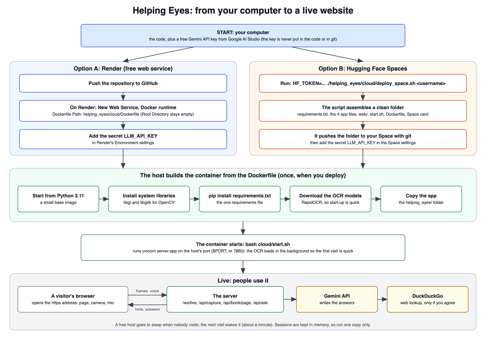

# How Helping Eyes is hosted

Hosting means putting the app on a computer that is always on, so anyone can open it from a web address.
Your own laptop is fine for testing (run `python run.py`, which does the same things on your computer), but a host is needed if other people should use it.

The app goes onto the host as a **container**. A container is a sealed box that has the app and everything
it needs inside, so it runs the same way on any host. A short recipe file (the `Dockerfile`) tells the host
how to build that box.

---

## What each file does

### The recipe files (`helping_eyes/cloud/`)

| File | What it does, in simple words |
|---|---|
| `Dockerfile` | The recipe for the box. It starts from a small Python system, adds the system libraries the picture code needs, installs the Python packages, downloads the OCR models (so the app starts quickly), and copies the app in. The host runs this once when you deploy. |
| `start.sh` | The start button inside the box. It starts the server on the port the host gives it (or port 7860 if none is given). |
| `deploy_space.sh` | A helper for Hugging Face only. It gathers just the files the host needs into a clean folder and uploads that folder to your Space. Run it with `--build-only <folder>` to see what it would upload without uploading anything. |
| `README.md` | The description card that Hugging Face shows on your Space page (its first lines also tell Hugging Face to use Docker and port 7860). Render does not use it. |

### The files that go into the box

| File | What it does |
|---|---|
| `requirements.txt` (top folder) | The one shopping list of Python packages. The `Dockerfile` installs everything on it. |
| `helping_eyes/server.py` | The front desk: receives pictures and requests from visitors and sends answers back. |
| `helping_eyes/vision.py` | The eyes: reads text from pictures, fixes bad photos, understands book pages, and gives the "move closer" hints. |
| `helping_eyes/commands.py` | The listener: decides if what you said is a command or a question. |
| `helping_eyes/assistant.py` | The answerer: asks the AI model (Gemini) and searches the web when you agree. |
| `helping_eyes/web/` | The web page itself: `index.html` (layout), `app.js` (camera, voice and speaking), `style.css` (looks) and `favicon.svg` (the small tab icon). |

Not sent to the host: `tests/`, `docs/`, `presentation/` and the helper tools. They are only for you.

### Your secrets and settings

| File | What it does |
|---|---|
| `helping_eyes/.env.example` | A template of the settings. On your own laptop you copy it to `.env` and put your key in it. **On a host you do not upload a `.env` file.** You type the key into the host's settings page instead (see below). |
| `.gitignore` | Tells git never to save your private `.env` file (and other local files like `.venv`), so your key cannot end up on GitHub by accident. |

### A safety check (not part of hosting)

| File | What it does |
|---|---|
| `.github/workflows/check.yml` | Makes GitHub run all the tests every time you push code. It does not deploy anything; it only tells you if something broke. |

---

## The settings the host needs

You set these on the host's settings page, not in the code:

| Setting | Needed? | What it is |
|---|---|---|
| `LLM_API_KEY` | **Yes** | Your free key from [Google AI Studio](https://aistudio.google.com/apikey). Keep it secret. |
| `LLM_MODEL` | No | Which AI model to use. The default is `gemini-3.1-flash-lite`. Google retires and restricts old model names, so if the app says the model name was not found, look up the current Flash-Lite name on Google's model page and set it here. |
| `LLM_BASE_URL` | No | Which AI service to talk to. The default is Google's. Change it (with the model and key) to use another provider, such as Groq or OpenRouter. |
| `PORT` | No | The host sets this for you. The app falls back to 7860. |

---

## Step by step

### Option A: Render (free web service)

1. Get your free key from Google AI Studio.
2. Push the whole project to GitHub.
3. On Render choose **New → Web Service**, connect the repository, and pick the **Docker** runtime.
4. Set **Dockerfile Path** to `helping_eyes/cloud/Dockerfile` and leave **Root Directory** empty, so Render can see the one `requirements.txt` in the top folder.
5. Choose the **Free** instance type, then under **Environment** add `LLM_API_KEY` with your key.
6. Press deploy. The first build takes a few minutes (it downloads the OCR models). When it finishes, Render shows your web address.

### Option B: Hugging Face Spaces (needs a paid PRO plan for Docker now)

1. On huggingface.co create a **New Space**, choose the **Docker** SDK and **CPU basic** hardware.
2. Create a write token under **Settings → Access Tokens**.
3. In the Space's **Settings → Variables and secrets** add the secret `LLM_API_KEY`.
4. On your computer run `HF_TOKEN=hf_xxx ./helping_eyes/cloud/deploy_space.sh <your-username>`. The script assembles the clean folder and pushes it.
5. Hugging Face builds the box. Your address is `https://<your-username>-helping-eyes.hf.space`.

### Option C: your own laptop, free, no card (recommended)

The laptop is the server and a free Cloudflare Quick Tunnel gives it a public `https` address. No account, no card, and your laptop's memory is more than the OCR needs.

1. Install the tunnel once: `brew install cloudflared`.
2. Run `python run.py --share`. It starts the app, opens the tunnel and prints a `https://...trycloudflare.com` address.
3. Open that address on any device. Stop with Ctrl+C.

The address works only while the laptop is awake and the program is running (on a Mac, `run.py` also runs `caffeinate` so it does not sleep when idle), and it is new every run. Anyone with the address uses your language-model key's quota.

### After it is live

1. Open `your-address/api/health`. You should see `"status":"ok"` and `"llm_configured":true` (if it says `false`, the key is missing in the host's settings). It also shows how the server is doing: `"ocr"` (`"ready"` once the start-up warm-up has finished), `"memory_mb"` (what the app uses now), `"memory_limit_mb"` (what the host allows, when it says) and `"cpus"`. If `memory_mb` sits near `memory_limit_mb`, or `"ocr"` never reaches `"ready"`, the host is too small.
2. Open the main address, allow the camera and microphone, and show something to the camera. Hosts give you `https`, which the browser needs before it will allow the camera.

To update the live app later, push your changes again (Render rebuilds by itself if auto-deploy is on) or run the deploy script again.

---

## Things to know

- **Free hosts go to sleep.** When nobody visits for a while the app sleeps, and the next visit wakes it up, which takes about a minute. Open the address a few minutes before a demo.
- **Memory: Render's free plan is too small.** I measured the OCR here: about 375 MB once its models are loaded, and 770 MB to 980 MB while reading a full photo or a book page. Render's free plan allows 512 MB, so the app is killed the first time it reads a picture. It then restarts, and for a minute every request gets the host's HTML error page. The page shows this as "The server is not responding... out of memory" (older versions showed "Unexpected token '<'"). Check `/api/health`, the host's Logs and its Metrics. The server also logs its memory at each start-up step (`Warm-up: ... memory 375 MB`) and on every capture, so the last line before a restart shows how far it got. The start-up warm-up itself reads a sample picture and peaked near 1 GB when I measured it. Fix it by using a host or plan with at least 2 GB; shrinking the pictures did not help enough (the smallest setting I tried still peaked near 650 MB and was 2 to 3 times slower).
- **Run only one copy.** Each visitor's captured text and conversation are kept in the server's memory, so two copies would not share them. A restart clears them.
- **Hugging Face needs a paid plan.** Docker Spaces on CPU basic now require PRO.
- **The free Gemini limits.** The free AI plan has a daily limit. When it is used up, the app says the model is busy. Expiry questions, page-number questions and "read everything" never use the AI, so they keep working.
- **Privacy.** The text of what you capture (never the picture) is sent to the AI service. On a free plan the provider may be allowed to use it, so check their terms before using it on private documents.
- **Not tested here.** I could not build the container or try either host from this computer. I did check that the folder the deploy script assembles contains every file the recipe needs, and that the server starts from it the way `start.sh` starts it. Your first real deploy is the real test.
