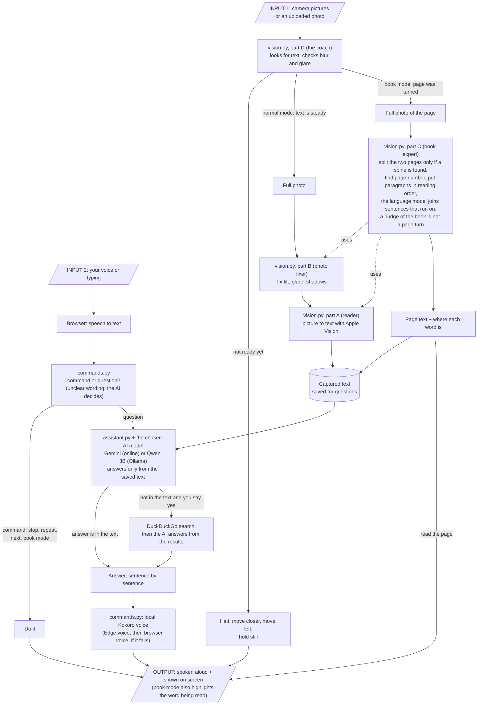

# How Helping Eyes works

Helping Eyes helps a person who cannot see well to read things like medicine boxes, letters and books.
You show the item to the camera. The app tells you how to hold it, takes a photo by itself, and then you
can ask questions like "When does it expire?" or just say "read everything".

It is **one app**. It has two parts:

- **The browser page** (what you see and hear): it uses the camera, the microphone and the speaker.
- **The server** (the brain): it finds the text in the picture, understands what you asked, and writes the answer.

The app runs on your own Mac. With `python run.py --share` it also gets a public address, so other people can use it while your Mac is awake.

---

## What each file does

### The brain (`helping_eyes/`)

| File | What it does, in simple words |
|---|---|
| `server.py` | The front desk of the server. It receives camera pictures, photos and questions from the browser and sends back guidance and answers. It also remembers each person's item and conversation for 30 minutes. |
| `vision.py` | All the computer vision (looking at pictures), in four parts, so it is easy to find: **Part A, the reader:** turns a picture into text (OCR) with Apple Vision (built into macOS), which runs on this Mac. It can also quickly check whether any text is in view. **Part B, the photo fixer:** measures blur, glare and darkness, straightens a tilted page, flattens a curved page and brightens shadows, so the reader gets a cleaner picture. **Part C, the book expert:** finds the middle of an open book, splits the two pages, finds page numbers and titles, puts paragraphs in the right reading order (then the language model joins sentences that run over a line, column or page, and reads a sidebar or box after the main text instead of line by line across it), copes with a page photographed at a slant (it measures the slant, straightens the page to work out lines and paragraphs, and draws boxes that lean with the text), and keeps your place if the book moves a little. **Part D, the coach:** looks at the live camera pictures and decides "move closer", "move left", "too blurry", "hold still" and "now take the photo". In book mode it notices when you turn a page and decides what to read next. |
| `commands.py` | The listener and the voice. It decides if what you said is a command ("stop", "next", "book mode", "yes", "no", "look it up") or a question for the AI. Clear wordings are matched directly; when the wording is unclear (for example a different way of saying "yes, search the web"), the AI is asked what you meant, so any wording that means "look it up" works. It also turns each sentence into spoken audio: first with the free Kokoro voice that runs on this Mac (set up once with `python run.py --get-voice`), and with a free Microsoft Edge voice if that is missing or fails (Sarah, an American female voice, by default), and spells out long numbers (above 9999) digit by digit, because they are serial numbers. |
| `assistant.py` | The answerer. It keeps the text that was captured and talks to an AI chat model: Gemini over the internet by default (any provider with an OpenAI-style API works) or Qwen 3B running on your Mac through Ollama, whichever you pick in the page's Model menu. It only answers from the captured text. It works out expiry dates itself, because small AI models get dates wrong. It can search the web, but only if you say yes. It also reads unclear "yes / no / search" wording. |
| `models/` | The Kokoro voice model files (about 350 MB). `python run.py --get-voice` downloads them once; they are not kept in git. |
| `.env.example` | A sample of the settings. Copy it to `.env` and put your AI key in it (the only required setting); you can also change the model or provider there. |

### The face (`helping_eyes/web/`)

| File | What it does |
|---|---|
| `index.html` | The page layout: the camera picture, the buttons, the Model menu and the answer area. |
| `app.js` | The ears, mouth and eyes in the browser. It opens the camera, sends pictures to the server, plays the spoken hints and answers (the server's voice, with the browser's own voice as a backup), listens to your voice, and draws the boxes and the highlighted word on top of the camera picture. An uploaded photo is shown in its place, with the same boxes, the sharpness, light and glare figures, and (in book mode) the same reading highlight. It makes no decisions itself; it does what the server says. |
| `style.css` | How the page looks (colours, big buttons, dark mode). On a laptop screen everything fits the window with no scrolling. |
| `favicon.svg` | The small icon in the browser tab. |

### The checkers (`helping_eyes/tests/`)

There is one test file for each part of `vision.py`, plus one each for the other modules. They use made-up pictures and a fake AI server, so none of them needs a camera, an API key or internet.

| File | What it checks |
|---|---|
| `test_vision_ocr.py` | Part A (the reader): that text in a picture is read in the right order, that boxes and word positions are right, that blank pictures give nothing, and that a slanted page is measured, keeps its paragraphs and gets boxes that lean with the text. |
| `test_vision_quality.py` | Part B (the photo fixer): tilt, curve, blur, glare and darkness on made-up pages. |
| `test_vision_book.py` | Part C (the book expert): page numbers, headers and footers, reading order of columns and paragraphs, finding the middle of a book, noticing page turns, and keeping your place when the book moves. |
| `test_vision_live.py` | Part D (the coach): hints, hold-still timing, capture, and the book-page decisions, including the AI's paragraphs (a sidebar is its own block and is read after the main text, a sentence that runs over a column or page is one paragraph, and if the AI cannot answer the page is read as laid out). |
| `test_commands.py` | That "stop", "next", "yes", "book mode" and similar are understood correctly, in many wordings, and that unclear wording is left to the AI. Also the voice: the local voice speaks first, Edge is the backup, long text is spoken in pieces with nothing dropped, and the audio is real MP3. |
| `test_llm.py` | The AI client against a pretend AI server: the Gemini / Qwen choice picks the right model, sentences arrive one by one, errors are spoken plainly, the web-search offer works, and expiry questions never call the AI. Also that the AI's grouping of a book page's lines is accepted only when no line is lost or doubled. |
| `test_server.py` | The whole server for real: reading a picture of a label, answering, the live stream, book pages, and the voice endpoint (which voice is first is shown in the health check). |
| `test_run.py` | The start button: that it finds the packages and the key, picks a free port, really starts the app, serves the page, and stops cleanly. The local voice is optional and reported in one line. |
| `test_web_mic.py` | The microphone side of the web page, opened in a hidden Chrome with a pretend speech engine: words show while you speak, the finished sentence is sent, silence just listens again, and a missing or blocked microphone, or an unreachable speech service, is explained out loud and on screen. Also the voice side: a voice request that never answers is replaced by a second one. Skipped if Chrome is not installed. |

To run them all: `cd helping_eyes` and then `for t in tests/test_*.py; do python "$t" || break; done`.

### Everything else

| File or folder | What it does |
|---|---|
| `README.md` | The full project report: problem, design, how to run it, results, limits. |
| `working.md` | This file. |
| `direction.md` | What each button does and what you can say or type. |
| `hosting.md` | A plain-language guide to hosting the app from your Mac: setup, the `--share` command, the settings and what to expect. |
| `run.py` | The start button for your own laptop. One command, `python run.py`, starts everything: it checks that Python and the packages are fine, tells you if your AI key is missing, starts Ollama if it is installed and not already running, loads the Qwen model into memory (for the Qwen choice), starts the server, waits until the text reader has loaded, and opens the app in Chrome. Chrome does the camera, the microphone and listening. With `python run.py --share` it also opens a free tunnel and prints a public address for other devices: the same fixed address every time with ngrok (set `NGROK_DOMAIN`), or a new Cloudflare address each run. It picks another port if the usual one is busy, and stops cleanly with Ctrl+C. |
| `requirements.txt` | The one shopping list of Python packages for the whole project: running the app and the tests both use it. Install with `pip install -r requirements.txt` from the top folder. |
| `docs/` | Pictures used in the docs: the architecture diagram and book-mode screenshots. `make_architecture.py` redraws the diagram (`python docs/make_architecture.py`) whenever it changes. |
| `presentation/` | The slides, the narrated video, the script and the course requirements document. |
| `.github/workflows/check.yml` | Makes GitHub run all the tests automatically whenever code is pushed. |
| `graphify-out/` | A map of the code made by a helper tool (graphify). Not part of the app, and ignored by git, so it is never committed. |
| `.gitignore` | Tells git which files to ignore: your private `.env`, the `.venv` folder, `__pycache__` and `graphify-out/`. |

---

## The life cycle: from input to output

### The same life cycle in words

1. **Input:** the camera sends small pictures all the time (or you upload a photo, which is shown in place of the camera), and you speak or type.
2. **Coaching:** The coach (`vision.py`, part D) looks at each picture. If the text is not ready, you hear a hint ("Move closer"). When it is steady, a full photo is taken. In book mode, a full photo is taken each time a page was turned.
3. **Getting the text:**
   - A normal photo is cleaned by the photo fixer (`vision.py`, part B), then read by the reader (`vision.py`, part A), and the text is saved.
   - A book photo goes through the book expert (`vision.py`, part C), which splits the pages, finds the page number and puts the paragraphs in order (using the photo fixer and the reader). Before a new page is spoken, the language model is asked which lines belong to the same paragraph, so a sentence that runs over a line, column or page is read without a pause; if it cannot answer, the page is read as laid out. The page is read out straight away and also saved.
4. **Understanding you:** your voice becomes text in the browser. `commands.py` decides if it is a command ("stop", "next") or a question.
5. **Answering:** commands are just done. Questions go to `assistant.py`, which asks the AI chat model to answer using only the saved text. If the text does not have the answer, it offers a web search and searches only if you say yes.
6. **Output:** everything comes back to the browser, which shows it on screen and plays it aloud. The server turns each sentence into audio with the local Kokoro voice (a second or two per sentence, with the next sentences prepared while one plays; the free Edge voice is the backup); if both fail for a sentence, the browser's own voice speaks that sentence, and if a sound stalls the browser voice says the rest instead of skipping it. On a phone the sound starts after the first tap. While a book page is being read, the word being spoken is highlighted.
