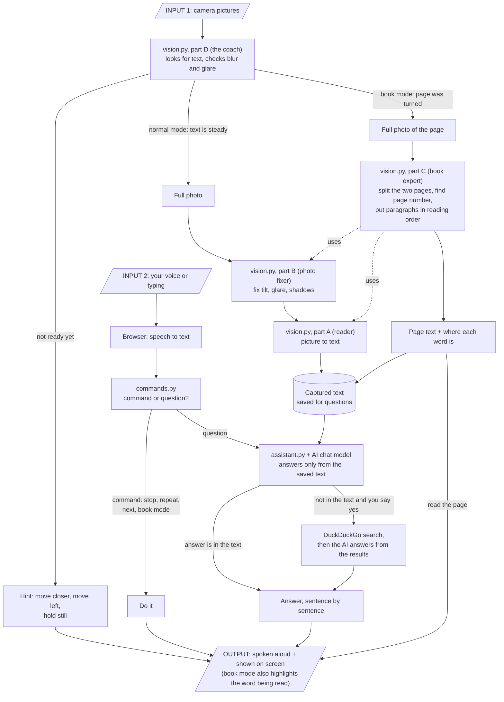

# How Helping Eyes works

Helping Eyes helps a person who cannot see well to read things like medicine boxes, letters and books.
You show the item to the camera. The app tells you how to hold it, takes a photo by itself, and then you
can ask questions like "When does it expire?" or just say "read everything".

It is **one app**. It has two parts:

- **The browser page** (what you see and hear): it uses the camera, the microphone and the speaker.
- **The server** (the brain): it finds the text in the picture, understands what you asked, and writes the answer.

You can run the same app on your own laptop or on the internet (Hugging Face). Only a few settings change.

---

## What each file does

### The brain (`helping_eyes/`)

| File | What it does, in simple words |
|---|---|
| `server.py` | The front desk of the server. It receives camera pictures, photos and questions from the browser and sends back guidance and answers. It also remembers each person's item and conversation for 30 minutes. |
| `vision.py` | All the computer vision (looking at pictures), in four parts, so it is easy to find: **Part A, the reader:** turns a picture into text (OCR) with Apple Vision (built into macOS), which runs on this Mac. It can also quickly check whether any text is in view. **Part B, the photo fixer:** measures blur, glare and darkness, straightens a tilted page, flattens a curved page and brightens shadows, so the reader gets a cleaner picture. **Part C, the book expert:** finds the middle of an open book, splits the two pages, finds page numbers and titles, puts paragraphs in the right reading order, and keeps your place if the book moves a little. **Part D, the coach:** looks at the live camera pictures and decides "move closer", "move left", "too blurry", "hold still" and "now take the photo". In book mode it notices when you turn a page and decides what to read next. |
| `commands.py` | The listener. It decides if what you said is a command ("stop", "next", "book mode", "yes", "no", "look it up") or a question for the AI. |
| `assistant.py` | The answerer. It keeps the text that was captured and talks to an AI chat model over the internet (Gemini Flash-Lite by default; any provider with an OpenAI-style API works). It only answers from the captured text. It works out expiry dates itself, because small AI models get dates wrong. It can search the web, but only if you say yes. |
| `.env.example` | A sample of the settings. Copy it to `.env` and put your AI key in it (the only required setting); you can also change the model or provider there. |

### The face (`helping_eyes/web/`)

| File | What it does |
|---|---|
| `index.html` | The page layout: the camera picture, the buttons and the answer area. |
| `app.js` | The ears, mouth and eyes in the browser. It opens the camera, sends pictures to the server, speaks the hints and answers out loud, listens to your voice, and draws the boxes and the highlighted word on top of the camera picture. It makes no decisions itself; it does what the server says. |
| `style.css` | How the page looks (colours, big buttons, dark mode). |
| `favicon.svg` | The small icon in the browser tab. |

### Putting it on the internet (`helping_eyes/cloud/`)

| File | What it does |
|---|---|
| `Dockerfile` | The recipe that builds the app into a package that runs on any host that runs Docker (Render, Hugging Face and others). There is no AI model inside; the app calls one over the internet. |
| `start.sh` | The start button inside that package: starts the server. |
| `deploy_space.sh` | One command that gathers the right files and uploads them to Hugging Face. |
| `README.md` | The description card shown on the Hugging Face page. |

### The checkers (`helping_eyes/tests/`)

There is one test file for each part of `vision.py`, plus one each for the other modules. They use made-up pictures and a fake AI server, so none of them needs a camera, an API key or internet.

| File | What it checks |
|---|---|
| `test_vision_ocr.py` | Part A (the reader): that text in a picture is read in the right order, that boxes and word positions are right, and that blank pictures give nothing. |
| `test_vision_quality.py` | Part B (the photo fixer): tilt, curve, blur, glare and darkness on made-up pages. |
| `test_vision_book.py` | Part C (the book expert): page numbers, headers and footers, reading order of columns and paragraphs, finding the middle of a book, noticing page turns, and keeping your place when the book moves. |
| `test_vision_live.py` | Part D (the coach): hints, hold-still timing, capture, and the book-page decisions. |
| `test_commands.py` | That "stop", "next", "yes", "book mode" and similar are understood correctly. |
| `test_llm.py` | The AI client against a pretend AI server: sentences arrive one by one, errors are spoken plainly, the web-search offer works, and expiry questions never call the AI. |
| `test_server.py` | The whole server for real: reading a picture of a label, answering, the live stream, and book pages. |
| `test_run.py` | The start button: that it finds the packages and the key, picks a free port, really starts the app, serves the page, and stops cleanly. |
| `test_web_mic.py` | The microphone side of the web page, opened in a hidden Chrome with a pretend speech engine: words show while you speak, the finished sentence is sent, silence just listens again, and a missing or blocked microphone, or an unreachable speech service, is explained out loud and on screen. Skipped if Chrome is not installed. |

To run them all: `cd helping_eyes` and then `for t in tests/test_*.py; do python "$t" || break; done`.

### Everything else

| File or folder | What it does |
|---|---|
| `README.md` | The full project report: problem, design, how to run it, results, limits. |
| `working.md` | This file. |
| `hosting.md` | A plain-language guide to hosting: what each hosting file does, the steps for Render and Hugging Face, and a flowchart from your computer to a live website. |
| `run.py` | The start button for your own laptop. One command, `python run.py`, does what the host does: it checks that Python and the packages are fine, tells you if your AI key is missing, starts the server, waits until the text reader has loaded, and opens the app in Chrome. Chrome does the camera, the microphone, listening and speaking. It picks another port if the usual one is busy, and stops cleanly with Ctrl+C. |
| `requirements.txt` | The one shopping list of Python packages for the whole project: running the app, the tests and the online package all use it. Install with `pip install -r requirements.txt` from the top folder. |
| `docs/` | Pictures used in the docs: the architecture diagram, the hosting flowchart and book-mode screenshots. `make_architecture.py` and `make_hosting.py` redraw the two diagrams (`python docs/make_architecture.py`, `python docs/make_hosting.py`) whenever they change. |
| `presentation/` | The slides, the narrated video, the script and the course requirements document. |
| `.github/workflows/check.yml` | Makes GitHub run all the tests automatically whenever code is pushed. |
| `graphify-out/` | A map of the code made by a helper tool (graphify). Not part of the app, and ignored by git, so it is never committed. |
| `.gitignore` | Tells git which files to ignore: your private `.env`, the `.venv` folder, `__pycache__` and `graphify-out/`. |

---

## The life cycle: from input to output

### The same life cycle in words

1. **Input:** the camera sends small pictures all the time, and you speak or type.
2. **Coaching:** The coach (`vision.py`, part D) looks at each picture. If the text is not ready, you hear a hint ("Move closer"). When it is steady, a full photo is taken. In book mode, a full photo is taken each time a page was turned.
3. **Getting the text:**
   - A normal photo is cleaned by the photo fixer (`vision.py`, part B), then read by the reader (`vision.py`, part A), and the text is saved.
   - A book photo goes through the book expert (`vision.py`, part C), which splits the pages, finds the page number and puts the paragraphs in order (using the photo fixer and the reader). The page is read out straight away and also saved.
4. **Understanding you:** your voice becomes text in the browser. `commands.py` decides if it is a command ("stop", "next") or a question.
5. **Answering:** commands are just done. Questions go to `assistant.py`, which asks the AI chat model to answer using only the saved text. If the text does not have the answer, it offers a web search and searches only if you say yes.
6. **Output:** everything comes back to the browser, which speaks it aloud and shows it on screen. While a book page is being read, the word being spoken is highlighted.
